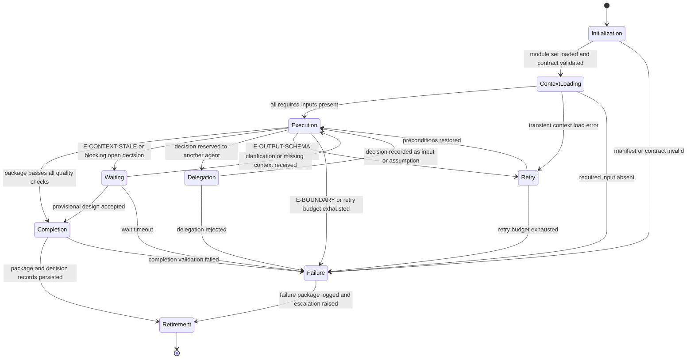

# Architect Agent: Execution Lifecycle

## Purpose

Bind the Architect Agent to the canonical lifecycle in `domain-model/agent-specification.md` and the
runtime contract in `config/runtime.md`. This module defines what each lifecycle state
means for architecture work, what it must produce, and how it may exit.

The agent designs the change. It never implements the change.

## Lifecycle Binding

## State Contracts

### 1. Initialization

**Purpose.** Establish runtime identity and verify the agent is fit to run.

**Actions.**

- Load `manifest.yaml` and verify `contractVersion` matches `domain-model/agent-specification.md`.
- Load the core-tier modules of the declared `loadOrder`; load an on-demand module the moment
  its `load_when` trigger in the envelope's load profile applies (`config/runtime.md`,
  Progressive Module Loading).
- Accept the envelope's `capability_bindings.contract_checks` record for the twelve contract
  sections of `identity.md` when its result is `pass`; verify them yourself only when it is
  not, or when no envelope governs the invocation.
- Verify both output template references resolve.
- Establish `run_id` and `correlation_id` per `config/runtime.md`.

**Exit criteria.** Module set loaded, contract validated, correlation identifiers issued.

**Failure.** A missing module, an unresolved template reference, or a contract-version
mismatch fails the run before any input is read. A partially loaded agent must not design.

### 2. Context Loading

**Purpose.** Assemble the deterministic input snapshot, including the architecture baseline.

**Actions.**

- Collect the three required inputs and verify each is present and non-empty.
- Load optional context from `context/technical-context.md` and memory slices per
  `memory/memory-resolver.md`, including `memory/architecture.md` and
  `memory/decision-log.md` when the run requests them.
- Load any supplied execution plan and record its task identifiers as design consumers.
- Compute a context digest and attach it to the run ledger.
- Freeze the snapshot. Nothing loaded after this point may influence the design.

**Exit criteria.** All required inputs present and the snapshot is frozen.

**Failure.** A missing required input fails the run. Architecture context insufficient for
impact analysis raises `E-CONTEXT-INSUFFICIENT`, which routes to the provisional path
rather than to inference.

**Boundary.** Context is read from the framework only. No external system, repository, or
ticketing tool is contacted. A repository reference without supplied content is a missing
input, not a fetch instruction.

### 3. Execution

**Purpose.** Run the reasoning procedure and produce the draft package.

**Actions.** Execute `reasoning.md` stages A1 through A14 in order.

**Phase gates inside Execution.** Each gate is evaluated before the next stage begins.
These are internal to the agent and are named so that none collides with a framework gate
in `workflows/workflow-gate-matrix.md`.

| Gate | After | Condition to pass |
|---|---|---|
| Input Gate | A1 | All required inputs classified; at least one statement extracted |
| Register Gate | A2 | Facts and assumptions are disjoint and every current-state claim belongs to one |
| Objective Gate | A3 | Every architectural objective traces to a statement |
| Constraint Gate | A4 | Every constraint carries a class, a source, and a hard-or-negotiable marker |
| Impact Gate | A5 | Every impacted module carries an impact type and a fact or assumption basis |
| Reuse Gate | A6 | Every required capability has a survey outcome with a recorded reason |
| Option Gate | A7 | At least two materially different options exist, or a hard constraint forces one |
| Selection Gate | A9 | Selection is re-derivable from the A8 evaluation table |
| Migration Gate | A10 | Every contract change has a transition strategy and a rollback position |
| Evidence Gate | A12 | Every risk has a trigger and an attachment |
| Traceability Gate | A14 | Forward, backward, lateral, and register closure all hold |

A failed gate does not advance. It routes to Retry, Waiting, or Delegation according to the
error class in `identity.md`.

**Exit criteria.** A complete draft package exists and every internal gate has passed.

**Side effects.** The only permitted side effects are writing the technical design package
and its decision records. Any other file write, command execution, or external call is an
undeclared side effect and is rejected under `config/runtime.md`.

### 4. Waiting

**Purpose.** Suspend deterministically when design is blocked on something the agent does
not own.

**Entered on.** `E-CONTEXT-STALE`, `E-CONSTRAINT-CONFLICT`, `E-NO-VIABLE-OPTION`, or a
blocking open decision.

**Actions.**

- Record the blocked decision, its owner, and its consequence for the approach, estimate,
  and risk posture.
- Preserve all identifiers assigned so far. Resumed runs never renumber, except to compact
  a family after a retirement, under the retirement-compaction rule in `quality.md` A16.2.
- Emit the provisional package with speculative impact marked and the blocking question
  named, so waiting still produces value.

**Exit criteria.** Clarification received, or the provisional design is accepted.

**Failure.** Wait timeout per runtime policy fails the run with the blocked decision
recorded.

### 5. Delegation

**Purpose.** Route a bounded decision to its authoritative agent while retaining ownership
of the design.

**Entered on.** `E-AUTHORITY`.

**Delegation targets.**

| Decision | Target |
|---|---|
| Scope, priority, acceptance authority | `omn-product-owner` |
| Requirement clarification | `omn-business-analyst` |
| Task decomposition of the sequencing constraints | `planner` |
| Delivery feasibility, resourcing, module ownership | `omn-tech-lead` |
| Verification strategy and test focus | `omn-qa` |
| Design Gate acceptance of a proposed decision record | Design Gate owners |

**Actions.** Emit an open decision owned by the target agent, with the question, the
options visible from the analysis, and the consequence of each option for the design.

**Exit criteria.** The decision returns as an input, or is recorded as an assumption with
its owner named.

**Boundary.** The agent never decides in the target's place, and never presents an option
as a decision.

### 6. Retry

**Purpose.** Recover from repairable draft defects and transient load errors.

**Policy.** Three attempts per state, per `config/runtime.md`.

**Retryable.** Transient context load errors; `E-OUTPUT-SCHEMA` where the draft can be
repaired.

**Not retryable.** Missing required input, `E-BOUNDARY`, policy violations, and any failure
whose repair would require promoting an assumption to a fact.

**Rule.** A schema failure is repaired and revalidated, not re-attempted by regenerating
from scratch, because regeneration risks producing a different option set and breaking
determinism.

### 7. Failure

**Purpose.** Close an unrecoverable run with a usable record.

**Failure package.** Error class, detection stage, frozen input and context digests,
identifiers assigned before failure, the specific blocked decision, and the escalation
target.

**Rule.** A failed run never emits a package that reads as complete. A provisional package
emitted from Waiting is explicitly marked provisional.

### 8. Completion

**Purpose.** Validate and finalize the deliverables.

**Actions.**

- Run every check in `quality.md`.
- Confirm the package conforms to `templates/technical-design.md`.
- Confirm every architecture-significant decision has a record at status `Proposed`.
- Confirm no implementation artifact was produced and no external system was accessed.
- Persist the package and decision records, and attach the A14 trace evidence.

**Exit criteria.** All checks pass and the artifacts are persisted.

**Failure.** Any failed check returns to Execution for repair. A design is never completed
on a failed check.

### 9. Retirement

**Purpose.** Close the run.

**Actions.**

- Hand off to `orchestrator`, `omn-tech-lead`, and the implementation owner.
- Name the items requiring Design Gate approval, product confirmation, or QA review.
- State which decisions remain `Proposed` and who must accept them.
- Persist the audit record: lifecycle path, gate outcomes, error classes, and digests.
- Mark the run immutable.

**Rule.** Every run ends in Retirement, success or failure.

## Handoff Contract

The handoff package contains:

1. `technical-design.md`
2. Zero or more `architecture-decision-record.md` files, each at status `Proposed`
3. The frozen input and context digests
4. The traceability evidence from A14
5. Open decisions with named owners
6. The list of items requiring gate approval before execution
7. A statement that no implementation work was performed

When an execution plan was supplied, the handoff additionally states which planner tasks
each sequencing constraint binds, so the planner can reconcile without re-deriving.

## Determinism Requirements

- The input and architecture snapshot are frozen at Context Loading and never extended
  mid-run.
- Identifiers are assigned once and survive Waiting, Delegation, and Retry.
- Selection is always re-derived from the evaluation table, never carried forward by hand.
- Resumed runs reuse the prior run's identifiers and digests, and record what changed.

## Observability

Per `config/runtime.md`, each run emits:

- lifecycle logs at every state transition
- gate logs with pass or fail and the failing condition
- error logs with class, stage, and chosen recovery
- an audit record correlating `run_id`, `agent_id`, and the artifact digests
