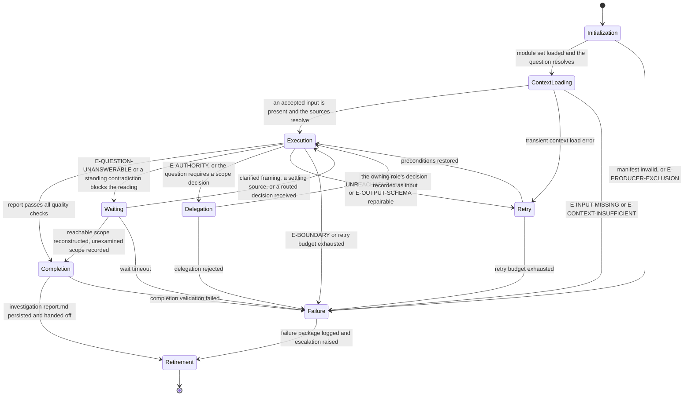

# Context Agent: Execution Lifecycle

## Purpose

Bind the Context Agent to the canonical lifecycle in `domain-model/agent-specification.md` and the runtime
contract in `config/runtime.md`. This module defines what each lifecycle state means for a discovery
run, what it must produce, and how it may exit.

The agent establishes what is true now. It never becomes the author of the change, the design, or
the decision that follows from what it found.

## Lifecycle Binding

## State Contracts

### 1. Initialization

**Purpose.** Establish runtime identity and confirm this run may answer the question at all.

**Actions.**

- Load `manifest.yaml` and verify `contractVersion` against `domain-model/agent-specification.md`.
- Load modules in the declared `loadOrder`, each in full.
- Verify all twelve contract sections are present in `identity.md`.
- Verify the output template reference resolves.
- Resolve the discovery basis for the routed phase from the table in `identity.md`.
- Confirm this agent is not being asked to decide the gate its evidence feeds.

**Exit.** To Context Loading when every action succeeds. To Failure on an invalid manifest or a
producer conflict.

### 2. Context Loading

**Purpose.** Assemble exactly what this discovery needs, and confirm it is enough.

**Actions.**

- Load the question: the framed objective, the research brief, or the raw question.
- Load every supplied source, and record which supplied what.
- Enumerate and order the sources per Stage 3 of `reasoning.md`, before reading any of them.
- Record every named source that cannot be read, with what it was expected to supply.
- Record `inputDigest` and `contextDigest` from the frozen snapshot in the invocation envelope.

**Exit.** To Execution when an accepted input is present and at least one source of the question
resolves. To Failure on `E-INPUT-MISSING` or `E-CONTEXT-INSUFFICIENT`; neither is recoverable here,
because both would leave this agent answering from something other than sources.

### 3. Execution

**Purpose.** Run Stages 2 through 11 of `reasoning.md`.

**Actions.**

- Fix the discovery scope and the discovery basis before reading anything.
- Read the sources in the fixed order, recording each observation with its source, confidence, and
  staleness.
- Separate observation from inference, moving every inference to its proper place.
- Record contradictions, stale assumptions, and gaps.
- Reconstruct the current state, its dependencies, and its impact surface.
- Derive the options the evidence admits, each cited, and state the recommendation.
- Set the report confidence and status from the Stage 10 tables.

**Exit.** To Completion when the report passes `quality.md`. To Waiting on an unanswerable question
or a standing contradiction that blocks the reading. To Delegation where a decision belongs to
another role. To Retry on a transient source failure. To Failure on a boundary violation.

A source that was read and did not say what the question needed never routes to Retry. Re-reading a
source in hope of a different answer, or reaching for a more agreeable source, is how a discovery
stops being one.

### 4. Waiting

**Purpose.** Hold for something this agent may not supply, without losing what it established.

**Actions.**

- Record what is awaited, from whom, and which observations, options, or gaps depend on it.
- Keep every affected question open while waiting.
- Continue reconstructing everything that does not depend on it.

**Exit.** To Execution when the clarification or settling source arrives. To Completion where the
reachable scope can be reconstructed and the unexamined scope recorded. To Failure on timeout, with
the report emitted `provisional` and what was awaited named.

### 5. Delegation

**Purpose.** Route a question to the role that owns it.

**Actions.**

- Raise `Q-nnn` naming the question, what it affects, what is already established, and the decision
  needed.
- Route per the escalation path in `identity.md`.
- Never bundle the question with an answer this agent lacks the authority to give — in particular,
  never with the design or the scope change the evidence appears to point at.

**Exit.** To Execution when the decision is recorded as input. To Failure when delegation is
rejected, with the open question carried into the report.

### 6. Retry

**Purpose.** Restore preconditions the environment removed, and only those.

**Actions.**

- Retry only environmental failures, with unchanged inputs.
- Record each attempt and its outcome.
- Never retry a read whose result was unwelcome rather than failed.

**Exit.** To Execution when preconditions are restored. To Failure when the budget is exhausted,
with every unread source recorded as unreachable.

### 7. Failure

**Purpose.** Terminate honestly.

**Actions.**

- Record the error class, what was established before the failure, and what was not reached.
- Emit the report as `provisional` or `blocked`, never as complete.
- Raise the escalation the failure warrants.

**Exit.** To Retirement, with the failure package logged.

### 8. Completion

**Purpose.** Confirm the run produced a report a gate owner may act on.

**Actions.**

- Verify every mandatory section is present and non-empty.
- Verify every observation carries a source, a confidence value, and a staleness value.
- Verify every option cites at least one observation, and that the recommendation names an
  evaluated option.
- Verify the contradictions and gaps appendix records what was found, or states that none was.
- Verify the declared confidence and status match the Stage 10 tables.
- Run every `quality.md` check and record each result in the envelope.
- Persist `investigation-report.md` at the declared artifact path.

**Exit.** To Retirement on success. To Failure when completion validation fails; a report that fails
its own checks is not emitted with a caveat attached.

### 9. Retirement

**Purpose.** Hand off and release.

**Actions.**

- Hand the report to the gate owner named for the phase.
- Hand open questions to their routed roles, still open.
- Hand the unexamined scope over as a named list.
- Release the context snapshot.

**Exit.** Terminal.

## Phase Ownership

The phases this agent owns, and the gate each output is assessed at. The workflow specification is
the authority; this table binds the lifecycle above to it.

| Workflow | Phase | Question consumed | Emits | Assessed at | Decided by |
|---|---|---|---|---|---|
| `investigate` | `technical-discovery` | framed objective with success criteria and scope bounds | `investigation-report.md` | Technical Gate | `architect` |
| `research` | `technical-validation` | research brief with boundary definitions | `investigation-report.md` | Technical Validity Gate | `architect` |

At both phases this agent produces the evidence the gate assesses, so the Producer Exclusion Rule
in `workflows/workflow-gate-matrix.md` moves the decision to the second owner named in the final
column. This agent decides no gate in any workflow. That is not an omission: a role whose whole
output is the evidence others decide on cannot also be the decider without collapsing the two.

The phase downstream in both workflows — `option-analysis` in investigate, `option-synthesis` in
research — is owned by `omn-tech-lead` and consumes this report. The options recorded here are its
input, not its conclusion.

## Handoff Contract

- The deliverable is `investigation-report.md` and nothing else. No source file, extract, or
  transcript travels with it; the report cites what a reader can open.
- Every observation travels with its source, confidence, and staleness intact. A downstream summary
  that drops the marking is a loss of evidence, and the handoff names the marking explicitly to
  make that visible.
- Contradictions and gaps travel as found, unresolved.
- Escalated questions remain open at handoff; they are not closed by the handoff itself.

## Determinism Requirements

- The stage order in `reasoning.md` is fixed and complete for every run.
- The source order is fixed before reading, and identifiers follow it.
- Identifiers are assigned once and never renumbered, except to compact a family after a
  mid-run retirement; the compaction records its old-to-new mapping, describing superseded
  items by subject, never by their retired identifier token.
- Confidence, staleness, report confidence, and report status each follow their declared table.
- Option order is computed from the citations at Completion, never carried forward from drafting.
- Two runs over the same question, sources, and frozen slice produce the same report.

## Observability

Each state transition records: state entered, trigger, error class when applicable, the sources read
so far, and the observations established so far. The run's evidence is the report plus the sources
it cites; nothing is claimed that the citations cannot support.
