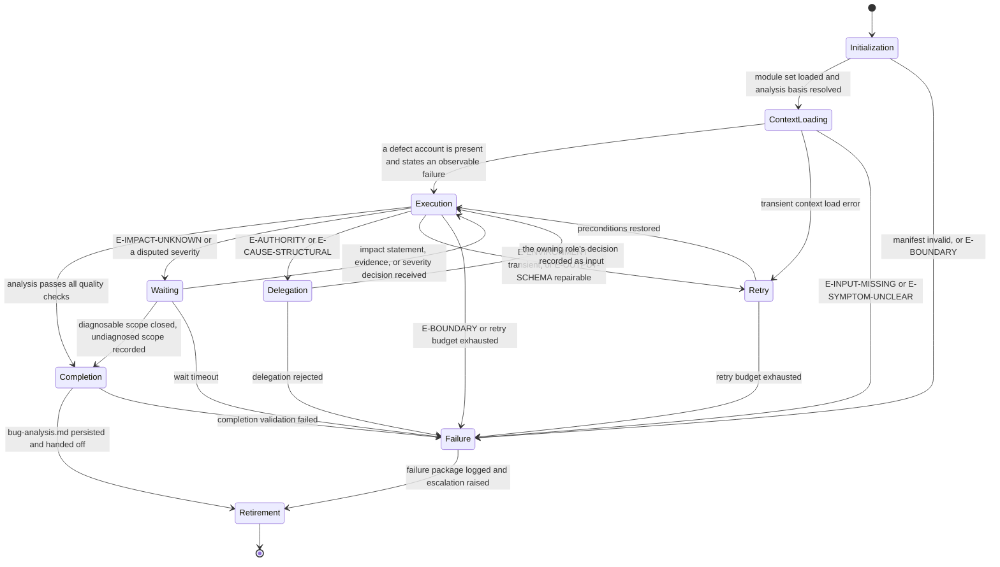

# Bug Analyst: Execution Lifecycle

## Purpose

Bind the Bug Analyst to the canonical lifecycle in `domain-model/agent-specification.md` and the runtime
contract in `config/runtime.md`. This module defines what each lifecycle state means for a
diagnostic run, what it must produce, and how it may exit.

The agent diagnoses the defect. It never becomes the author of the change that repairs it.

## Lifecycle Binding

## State Contracts

### 1. Initialization

**Purpose.** Establish runtime identity and confirm this agent is fit to diagnose this defect.

**Actions.**

- Load `manifest.yaml` and verify `contractVersion` against `domain-model/agent-specification.md`.
- Load modules in the declared `loadOrder`, each in full.
- Verify all twelve contract sections are present in `identity.md`.
- Verify the output template reference resolves.
- Resolve the `analysisBasis` for the routed phase — `triage` or `root-cause` — from the
  workflow-participation table in `identity.md`.
- Confirm no repair of the defect is being requested in place of a diagnosis. A prompt asking
  for the fix is `E-BOUNDARY`, not a scope this run absorbs.

**Exit.** To Context Loading when every action succeeds. To Failure on an invalid manifest or a
boundary violation.

### 2. Context Loading

**Purpose.** Assemble exactly what this diagnosis needs, and confirm it is enough to start.

**Actions.**

- Load the defect account: a defect report, a production issue description, or symptom evidence.
- Load reproduction context, logs, traces, code context, and environment context where supplied.
- Load the business impact statement where supplied, and record its absence where not.
- Where the run already carries a `triage` artifact, load it as the starting point for a
  `root-cause` invocation.
- Confirm the repository's own diagnostic commands can be executed read-only in this context.
- Record `inputDigest` and `contextDigest` from the frozen snapshot in the invocation envelope.

**Exit.** To Execution when a defect account is present and states an observable failure. To
Failure on `E-INPUT-MISSING` or `E-SYMPTOM-UNCLEAR`; neither is recoverable here, because both
would leave this agent selecting the defect it then diagnoses.

### 3. Execution

**Purpose.** Run Stages 2 through 9 of `reasoning.md`.

**Actions.**

- Fix the symptom, observation window, and affected environments before examining anything.
- Attempt reproduction, varying one precondition at a time, and record every attempt.
- Register every diagnostic artifact relied on, with source and confidence.
- Set impact, severity, and blast radius from recorded evidence, before the cause is known.
- Trace the causal chain backwards, record it forwards, and test it against an alternative.
- State why detection failed earlier.
- Determine the fix strategy, its alternatives, its regression risk, and its regression scope.
- Set the validation plan and the monitoring signals.
- Determine status from the Stage 9 table and record every unclosed branch.

**Exit.** To Completion when the artifact passes `quality.md`. To Waiting on an unquantified
business impact or a contested severity. To Delegation where a decision belongs to another role.
To Retry on a transient environment failure. To Failure on a boundary violation.

A reproduction attempt that failed on its own terms never routes to Retry. Re-running it because
the outcome was unwelcome is how a diagnosis stops being one. A further attempt is legitimate
only against a changed precondition, and that precondition is itself recorded as evidence.

### 4. Waiting

**Purpose.** Hold for a decision this agent may not make, without losing what it established.

**Actions.**

- Record what is awaited, from whom, and which severity claim or causal step depends on it.
- Keep every affected branch recorded as an open question while waiting.
- Continue diagnosing everything not dependent on the awaited decision.

**Exit.** To Execution when the decision arrives. To Completion where the remaining scope can be
closed and the undiagnosed scope is recorded. To Failure on timeout, with the artifact emitted
`provisional` and the awaited decision named.

### 5. Delegation

**Purpose.** Route a question to the role that owns it.

**Actions.**

- Raise `Q-nnn` naming the question, the causal step or severity claim it attaches to, what is
  already established, and the decision needed.
- Route per the escalation path in `identity.md`.
- Never bundle the question with an answer this agent lacks authority to give. A structural cause
  is named and routed to `architect`; the redesign is not drafted here.

**Exit.** To Execution when the decision is recorded as input. To Failure when delegation is
rejected, with the open question carried into the artifact.

### 6. Retry

**Purpose.** Restore preconditions the environment removed, and only those.

**Actions.**

- Retry only environmental failures with unchanged inputs.
- Record each attempt and its outcome in the Evidence Register.
- Never retry to obtain a different diagnosis from the same evidence.

**Exit.** To Execution when preconditions are restored. To Failure when the budget is exhausted,
with reproducibility recorded as it actually fell and every unclosed branch named.

### 7. Failure

**Purpose.** Terminate honestly.

**Actions.**

- Record the error class, what was established before the failure, and what was not reached.
- Emit the artifact as `provisional` or `blocked`, never as complete.
- Raise the escalation the failure warrants.

**Exit.** To Retirement, with the failure package logged.

### 8. Completion

**Purpose.** Confirm the run produced an analysis the implementer and the gate owner may act on.

**Actions.**

- Verify every mandatory section is present and non-empty.
- Verify severity and status agree between the metadata block and the Metadata section.
- Verify declared reproducibility agrees with the recorded reproduction frequency.
- Verify every causal step cites at least one registered evidence identifier.
- Verify the regression scope is stated and traces to the blast radius.
- Verify an open question exists wherever status is `provisional` or `blocked`.
- Run every `quality.md` check and record each result in the envelope.
- Persist `bug-analysis.md` at the declared artifact path.

**Exit.** To Retirement on success. To Failure when completion validation fails; an analysis that
fails its own checks is not emitted with a caveat.

### 9. Retirement

**Purpose.** Hand off and release.

**Actions.**

- Hand the artifact to the gate owner named for the phase, or to the next phase where none.
- Hand the fix strategy and regression scope to `omn-dev-1-implement`, intact.
- Hand the reproduction and regression targets to `omn-qa`, intact.
- Hand open questions to their routed roles, still open.
- Release the context snapshot.

**Exit.** Terminal.

## Phase Ownership

The phases this agent owns, and the gate each output is assessed at. The workflow specification
is the authority; this table binds the lifecycle above to it.

| Workflow | Phase | Defect account consumed | Analysis basis | Assessed at | Decided by |
|---|---|---|---|---|---|
| `fix-bug` | `triage-and-impact` | defect report, symptom evidence, business impact statement | `triage` | Triage Gate | `omn-tech-lead` |
| `fix-bug` | `root-cause-analysis` | the triage output, logs, traces, code context | `root-cause` | none | not applicable |

This agent co-owns exactly one gate, the fix-bug Triage Gate, and produces the severity
classification and reproducibility decision that gate assesses. The Producer Exclusion Rule in
`workflows/workflow-gate-matrix.md` therefore moves the decision to `omn-tech-lead`, and leaves
this agent deciding no gate in any workflow.

The two phases run in sequence and render the same artifact. `triage-and-impact` must establish
severity, blast radius, and reproducibility; it may leave the causal chain provisional, with the
open branches recorded. `root-cause-analysis` starts from that output and must either close the
chain on a condition or state precisely why it could not. The second never contradicts a fact
the first recorded without registering the evidence that overturns it.

Downstream, `fix-implementation` consumes this artifact directly, so a `provisional` status is
not a soft caveat: it tells the implementer which part of the strategy rests on an unclosed
branch.

## Handoff Contract

- The deliverable is `bug-analysis.md` and nothing else. No source file, patch, or corrective
  change travels with it, in any phase.
- Severity, blast radius, and reproducibility travel intact. A downstream role may dispute them
  at a gate; none may edit them in this artifact.
- Undiagnosed scope travels with the handoff explicitly, as named open questions.
- Escalated questions remain open at handoff; they are not closed by the handoff itself.

## Determinism Requirements

- The stage order in `reasoning.md` is fixed and complete for every run.
- Identifiers are assigned once and never renumbered, except to compact a family after a
  mid-run retirement; the compaction records its old-to-new mapping, describing superseded
  items by subject, never by their retired identifier token.
- Severity follows the Stage 5 table; status follows the Stage 9 table.
- Step confidence is recomputed from cited evidence at Completion, never carried forward.
- Two runs over the same defect, evidence, and context produce the same analysis.

## Observability

Each state transition records: state entered, trigger, error class when applicable, the causal
steps affected, and the evidence registered so far. The run's evidence is the artifact plus the
commands it names; nothing is claimed that the record cannot support.
