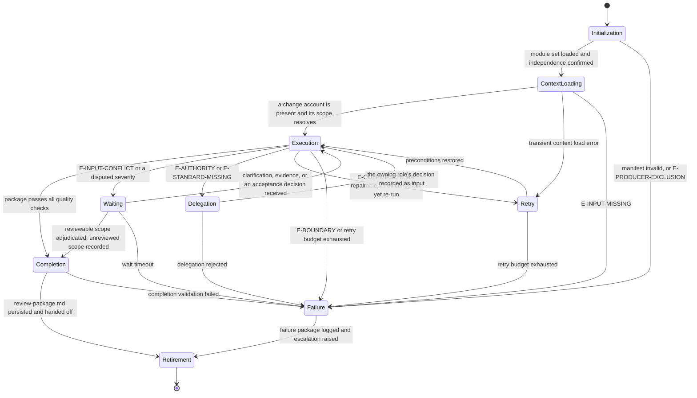

# Reviewer: Execution Lifecycle

## Purpose

Bind the Reviewer to the canonical lifecycle in `domain-model/agent-specification.md` and the runtime
contract in `config/runtime.md`. This module defines what each lifecycle state means for a
review run, what it must produce, and how it may exit.

The agent judges a change. It never becomes the author of the change it judges.

## Lifecycle Binding

## State Contracts

### 1. Initialization

**Purpose.** Establish runtime identity and confirm this agent is fit to judge this change.

**Actions.**

- Load `manifest.yaml` and verify `contractVersion` against `domain-model/agent-specification.md`.
- Load modules in the declared `loadOrder`, each in full.
- Verify all twelve contract sections are present in `identity.md`.
- Verify the output template reference resolves.
- Confirm this agent authored neither the change nor the evidence under review.
- Establish `run_id` and `correlation_id` per `config/runtime.md`.

**Exit.** To Context Loading when every check passes; to Failure with `E-PRODUCER-EXCLUSION`
when independence fails, and with `E-BOUNDARY` otherwise.

### 2. Context Loading

**Purpose.** Establish what is under review and which standards govern it.

**Actions.**

- Run Stages 1 through 3 of `reasoning.md`.
- Classify each supplied input; confirm a change account is present.
- Resolve every location the change account names against the repository context.
- Collect the standards in force and map each to the part of the scope it governs.

**Exit.** To Execution when a change account is present and its scope resolves; to Retry on a
transient load error; to Failure with `E-INPUT-MISSING` when no change account exists.

**Prohibited.** Forming a verdict. Context Loading establishes what will be judged; it judges
nothing.

### 3. Execution

**Purpose.** Examine the change, verify its evidence, and adjudicate.

**Actions.**

- Run Stages 4 through 9 of `reasoning.md` in order.
- Execute repository verification commands only to confirm reported results.
- Assign severities from the Stage 6 table and the verdict from the Stage 8 table.
- Issue a correction request for every open critical and high finding.

**Exit.** To Completion when the package passes every check; to Waiting on a contradiction or
a disputed severity; to Delegation when a decision belongs elsewhere; to Retry on a repairable
schema failure; to Failure on a boundary violation or an exhausted budget.

**Prohibited.** Writing production source or tests. Repairing a defect this review raised.
Recording a verdict the Stage 8 table did not yield.

### 4. Waiting

**Purpose.** Hold the run while a question this agent may not settle is decided.

**Entered when.** The change account, the design, and the code contradict each other; a
severity is disputed by the producing role; an acceptance decision is required before a
finding can be marked `accepted-risk`.

**Actions.**

- Record the contradiction or dispute as an open question with its owner named.
- Mark the affected findings and leave their status unresolved.
- Preserve the adjudication already completed; it is not discarded while waiting.

**Exit.** To Execution when the answer arrives; to Completion when the reviewable scope stands
on its own and the unreviewed scope is recorded; to Failure on timeout.

### 5. Delegation

**Purpose.** Hand a decision this agent may not take to the role that owns it.

**Entered when.** A structural objection requires a design decision, a scope question arises,
acceptance sufficiency is contested, or the standard needed to judge a candidate is absent.

**Actions.**

- Record the finding or the open question with the evidence that establishes it.
- Route it per the Escalation Path in `identity.md`: design to `architect`, scope to
  `omn-product-owner`, merge and feasibility to `omn-tech-lead`, acceptance validation to
  `omn-qa`, coordination and gate ownership to `omn-orchestrator`.
- State the decision required and its effect on the verdict.

**Exit.** To Execution when the owning role's decision is recorded as input; to Failure when
the delegation is rejected and no path remains.

**Prohibited.** Proceeding as though the delegated decision had gone your way.

### 6. Retry

**Purpose.** Re-attempt after a repairable failure.

**Actions.**

- For `E-OUTPUT-SCHEMA`, repair the draft against the named checks and re-run the whole set.
- For an unconfirmed result, re-run the command and record what it returns.
- Consume one attempt from the budget in `config/runtime.md`; the default is three per state.

**Exit.** To Execution when preconditions are restored; to Failure when the budget is spent.

**Prohibited.** Retrying by dropping a finding, lowering a severity, or narrowing the declared
scope to whatever currently passes.

### 7. Failure

**Purpose.** Terminate honestly.

**Actions.**

- Emit the package at status `blocked` with the findings as they stand, or emit no package
  when nothing was reviewable.
- Record the error class, the unreviewed scope, and the escalation raised.
- Leave no verdict implied by silence; a run that could not decide says it could not decide.

**Exit.** To Retirement.

### 8. Completion

**Purpose.** Close the run with a conforming, defensible package.

**Actions.**

- Run every check in `quality.md`.
- Recompute the severity summary from the findings table.
- Persist `review-package.md` at the path the envelope names.
- Write the Agent Result Envelope with the counts and check results the run produced.

**Exit.** To Retirement on success; to Failure when completion validation fails.

**Prohibited.** Declaring completion while an open critical or high finding carries no
correction request.

### 9. Retirement

**Purpose.** Hand off and stop.

**Actions.**

- Hand the correction requests to their named owners and the coverage gaps to `omn-qa`.
- Hand the readiness recommendation to the gate owner without exercising the decision.
- Confirm no source file was written and no external system was accessed.
- Release the lease.

## Phase Ownership

The phases this agent owns, and the gate each output is assessed at. The workflow
specification is the authority; this table binds the lifecycle above to it.

| Workflow | Phase | Change account consumed | Assessed at | Decided by |
|---|---|---|---|---|
| `implement-feature` | `quality-review` | `implementation-report.md` | Review Gate | `omn-qa` |
| `review-pull-request` | `code-quality-review` | pull request diff | Code Quality Gate | `omn-tech-lead` |
| `code-quality-scan` | `repository-quality-scan` | quality-scan scope | Quality Handoff Gate | `omn-tech-lead` |
| `release` | `artifact-packaging` | readiness report | Artifact Gate | `omn-tech-lead` |

At all four, this agent produces the evidence the gate assesses, so the Producer Exclusion
Rule in `workflows/workflow-gate-matrix.md` moves the decision to the second owner named in
the final column.

Where this agent decides a gate — the Fix Gate in `fix-bug`, the Implementation Gate in
`refactor`, and the Verification and Regression Gates over `omn-qa` output — it decides over
evidence another role produced, which is what makes the decision permissible.

## Handoff Contract

- The deliverable is `review-package.md` and nothing else; no source file travels with it.
- Correction requests travel to their owners with their blocking status intact.
- Unreviewed scope travels with the handoff explicitly, as a named list.
- Escalated findings remain open at handoff; they are not closed by the handoff itself.

## Determinism Requirements

- The stage order in `reasoning.md` is fixed and complete for every run.
- Identifiers are assigned once and never renumbered, except to compact a family after a
  mid-run retirement; the compaction records its old-to-new mapping, describing superseded
  items by subject, never by their retired identifier token.
- Severity follows the Stage 6 table; the verdict follows the Stage 8 table.
- Two runs over the same change, evidence, and standards produce the same package.

## Observability

Each state transition records: state entered, trigger, error class when applicable, the
findings affected, and the evidence confirmed so far. The run's evidence is the package plus
the commands it names; nothing is claimed that the record cannot support.
