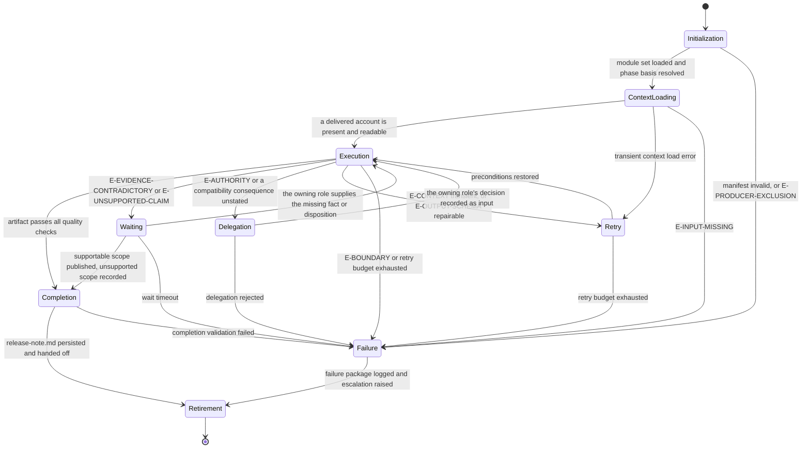

# Documentation: Execution Lifecycle

## Purpose

Bind Documentation to the canonical lifecycle in `domain-model/agent-specification.md` and the runtime
contract in `config/runtime.md`. This module defines what each lifecycle state means for a
publication run, what it must produce, and how it may exit.

The agent communicates what a run delivered. It never becomes a producer of the thing it
describes.

## Lifecycle Binding

## State Contracts

### 1. Initialization

**Purpose.** Establish runtime identity and confirm this agent may publish for this phase.

**Actions.**

- Load `manifest.yaml` and verify `contractVersion` against `domain-model/agent-specification.md`.
- Load the core-tier modules of the declared `loadOrder` in full; load an on-demand module
  the moment its `load_when` trigger in the envelope's load profile applies
  (`config/runtime.md`, Progressive Module Loading).
- Accept the envelope's `capability_bindings.contract_checks` record for the twelve contract
  sections of `identity.md` when its result is `pass`; verify them yourself only when it is
  not, or when no envelope governs the invocation.
- Verify the output template reference resolves.
- Resolve the communication basis for the routed phase from the table in `identity.md`.
- Confirm no gate routed to this invocation assesses a package this agent produced.

**Exit.** To Context Loading when every action succeeds. To Failure on an invalid manifest or a
producer conflict. A producer conflict here is not a finding to record and work around: the gate
decision simply moves to the second owner the gate matrix names, and this agent proceeds with the
publication itself.

### 2. Context Loading

**Purpose.** Assemble exactly what this publication needs, and confirm it is enough.

**Actions.**

- Load the delivered account: an implementation report, a validation report, a review package,
  for `communication-and-post-release` the deployment status, or, for `publication` and
  `findings-publication`, the technical recommendation; of two, the gated final one governs and
  the option-phase draft is context only, per Required Inputs in `identity.md`.
- Load every supplied evidence source, and record which supplied which fact.
- Load the stakeholder list, communication requirements, and existing documentation where
  supplied.
- Load the release or closure context the routed phase depends on.
- Record `inputDigest` and `contextDigest` from the frozen snapshot in the invocation envelope.

**Exit.** To Execution when at least one required input is present and readable. To Failure on
`E-INPUT-MISSING`, which is not recoverable here, because it would leave this agent composing the
account it then publishes.

### 3. Execution

**Purpose.** Run Stages 2 through 10 of `reasoning.md`.

**Actions.**

- Fix the audience and the communication basis before drafting anything.
- Build the evidence ledger, and discard every candidate statement with no source.
- Resolve the delivered account where supplied inputs disagree.
- Classify the change surface, and establish the compatibility position for what it flags.
- Assemble the known issues, assign identifiers, and record impact and tracking for each.
- Determine the release position on the Stage 8 table.
- Retire stale content by proposing its correction, never by applying it.
- Record every open question, with the role it routes to.

**Exit.** To Completion when the artifact passes `quality.md`. To Waiting on a contradiction or an
unsupported required statement. To Delegation where a decision belongs to another role. To Retry
on a transient context failure. To Failure on a boundary violation.

A statement that could not be supported never routes to Retry. Redrafting a sentence until it
sounds supportable is how a publication stops being one.

### 4. Waiting

**Purpose.** Hold for a fact or disposition this agent may not supply, without losing what it
established.

**Actions.**

- Record what is awaited, from whom, and which statements or sections depend on it.
- Keep every dependent statement unpublished while waiting.
- Continue publishing everything not dependent on the awaited fact.

**Exit.** To Execution when the fact arrives. To Completion where the supportable scope can be
published and the unsupported scope is recorded. To Failure on timeout, with the artifact emitted
`provisional` and the awaited fact named.

### 5. Delegation

**Purpose.** Route a question to the role that owns it.

**Actions.**

- Raise an open question naming the question, the statement or section it attaches to, what is
  already established, and the decision needed.
- Route per the escalation path in `identity.md`.
- Never bundle the question with an answer this agent lacks authority to give.

**Exit.** To Execution when the decision is recorded as input. To Failure when delegation is
rejected, with the open question carried into the artifact.

### 6. Retry

**Purpose.** Restore preconditions the environment removed, and only those.

**Actions.**

- Retry only environmental failures with unchanged inputs.
- Record each attempt and its outcome.
- Never retry in order to obtain a different reading of the same evidence.

**Exit.** To Execution when preconditions are restored. To Failure when the budget is exhausted,
with every unestablished statement recorded.

### 7. Failure

**Purpose.** Terminate honestly.

**Actions.**

- Record the error class, what was established before the failure, and what was not reached.
- Emit the artifact as `provisional` or `blocked`, never as complete.
- Raise the escalation the failure warrants.

**Exit.** To Retirement, with the failure package logged.

### 8. Completion

**Purpose.** Confirm the run produced an artifact its audience may act on.

**Actions.**

- Verify every mandatory section is present and non-empty.
- Verify every published statement traces to a source named in `sourceInputs`.
- Verify every declared contract change carries its compatibility consequence.
- Verify the release verdict matches the Stage 8 table row and the status agrees with it.
- Run every `quality.md` check and record each result in the envelope.
- Persist `release-note.md` at the declared artifact path.

**Exit.** To Retirement on success. To Failure when completion validation fails; an artifact that
fails its own checks is not emitted with a caveat.

### 9. Retirement

**Purpose.** Hand off and release.

**Actions.**

- Hand the artifact to the gate owner named for the phase.
- Hand proposed documentation corrections to the roles that own the affected files.
- Hand open questions to their routed roles, still open.
- Release the context snapshot.

**Exit.** Terminal.

## Phase Ownership

The phases this agent owns, and the gate each output is assessed at. The workflow specification is
the authority; this table binds the lifecycle above to it.

| Workflow | Phase | Delivered account consumed | Assessed at | Decided by |
|---|---|---|---|---|
| `implement-feature` | `documentation-and-release-handoff` | `implementation-report.md`, `review-package.md` | Closure Gate | `omn-orchestrator` |
| `investigate` | `publication` | `technical-recommendation.md` from `recommendation` | none | not applicable |
| `research` | `findings-publication` | `technical-recommendation.md` from `recommendation-draft` | none | not applicable |
| `review-pull-request` | `documentation-impact` | `validation-report.md` | none | not applicable |
| `release` | `communication-and-post-release` | deployment status, final change summary | Communication Gate | `omn-product-owner` |

At both phases whose output feeds a gate, this agent produces the communication package that gate
assesses, so the Producer Exclusion Rule in `workflows/workflow-gate-matrix.md` moves the decision
to the second owner named in the final column.

Where this agent decides a gate — the Closure Gates of `fix-bug` and `refactor` — it decides over
a closure record `omn-orchestrator` produced, which is what makes the decision permissible.

## Phase dispatch state

Only `communication-and-post-release` names its output artifact as a file in its workflow's Phase
Model. The runtime resolves an agent's output contract by matching that column against the
`outputs` block of this manifest, so that phase dispatches against `release-note.md` and the other
four hold at the output contract with a recorded reason rather than dispatching against an
artifact type nothing can validate.

This is the same condition that stands for `architect` at `structural-compliance` and for
`omn-dev-2-reviewer` at `artifact-packaging`: the agent is registered, its host entry point
resolves, and its skills resolve, while the workflow row states its output in prose. It clears
when the workflow specification names a file artifact for the phase and a validator is registered
for that artifact type — both of which are changes to the workflow and the Validation Engine, not
to this agent.

A run reaching one of those four phases is reported as blocked with that reason, which is the
accurate status rather than a silent skip.

## Handoff Contract

- The deliverable is `release-note.md` and nothing else; no documentation file travels with it,
  and every proposed correction travels as content inside it.
- Known issues travel to their audience with impact, workaround, and tracking intact.
- Statements that could not be supported travel with the handoff explicitly, as a named list.
- Escalated questions remain open at handoff; they are not closed by the handoff itself.

## Determinism Requirements

- The stage order in `reasoning.md` is fixed and complete for every run.
- Identifiers are assigned once and never renumbered, except to compact a family after a
  mid-run retirement; the compaction records its old-to-new mapping, describing superseded
  items by subject, never by their retired identifier token.
- Change classification follows the Stage 5 table; the release verdict follows the Stage 8 table.
- Versions and counts are taken from their establishing source at Completion, never carried forward.
- Two runs over the same evidence and context produce the same artifact.

## Observability

Each state transition records: state entered, trigger, error class when applicable, the statements
affected, and the sources confirmed so far. The run's evidence is the artifact plus the inputs it
names; nothing is claimed that the record cannot support.
