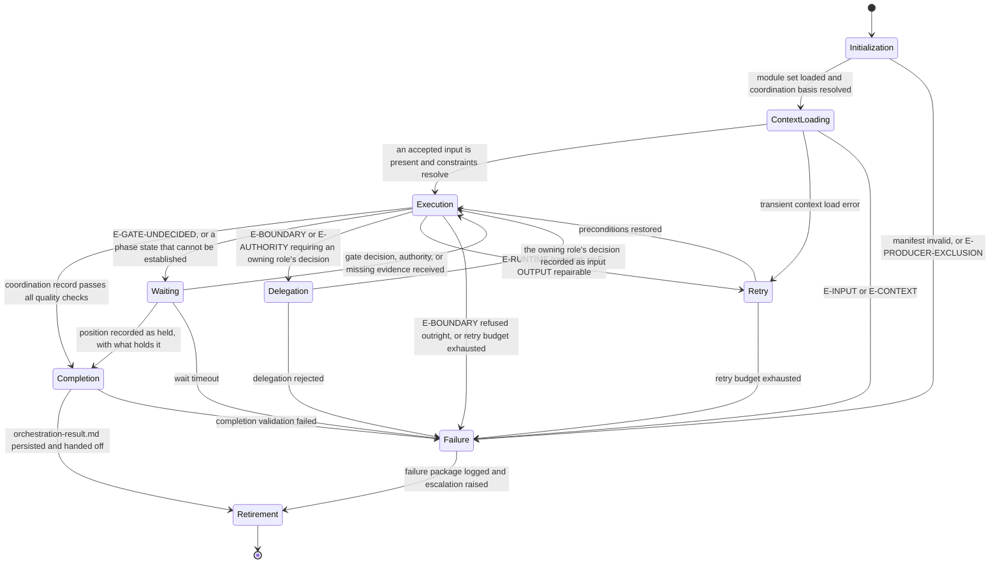

# Orchestrator: Execution Lifecycle

## Purpose

Bind `omn-orchestrator` to the canonical lifecycle in `domain-model/agent-specification.md` and the runtime
contract in `config/runtime.md`. This module defines what each lifecycle state means for a
coordination account, what it must produce, and how it may exit.

The agent holds transitions at their gates. It never becomes the authority that decides the gate its
own record is evidence for — and this role runs inside the very lifecycle it accounts for, which is
why its own invocation is governed exactly like any other phase's rather than exempted from it.

## Lifecycle Binding

## State Contracts

### 1. Initialization

**Purpose.** Establish runtime identity and confirm this agent is fit to coordinate this run.

**Actions.**

- Load `manifest.yaml`; verify `metadata.identifier`, `metadata.version`, `metadata.status`, and
  `contractVersion` against `domain-model/agent-specification.md`.
- Load the core-tier modules of the declared `loadOrder` in full, in that sequence; load an
  on-demand module the moment its `load_when` trigger in the envelope's load profile applies
  (`config/runtime.md`, Progressive Module Loading).
- Verify the output template reference resolves.
- Resolve the routed workflow and phase against `supportedWorkflows`; resolve the
  `coordinationBasis` and the deciding gate authority from the workflow-participation table in
  `identity.md`.
- Confirm this agent is not being asked to decide a gate over evidence it produces.

**Exit.** To Context Loading when every check holds. To Failure on an invalid manifest, an
unroutable phase, or `E-PRODUCER-EXCLUSION`.

### 2. Context Loading

**Purpose.** Freeze the evidence the account will be reconstructed from.

**Actions.**

- Hydrate the declared context slice; record the digest of every member.
- Confirm at least one accepted input is present, per the input contract in `identity.md`.
- Load the routed workflow's Phase Model and the gate matrix rows for this workflow. These are the
  two authorities the account transcribes; a run whose Phase Model cannot be read cannot be
  coordinated.
- Under a `deployment` basis, note whether the deployment and rollback plans are present.
- Record every contradiction between supplied inputs, without resolving any of them yet.

**Exit.** To Execution when an accepted input is present and the Phase Model resolves. To Retry on a
transient load error. To Failure on `E-INPUT` (no accepted input) or `E-CONTEXT` (the Phase Model or
gate matrix unreadable).

### 3. Execution

**Purpose.** Reconstruct the progression, verify each transition, and derive the position.

**Actions.** Run `reasoning.md` steps 3 through 10 in order. Nothing is written to the artifact path
until step 11 has run.

**Internal gates.** Each must pass before the next step proceeds:

| Gate | Holds that |
|---|---|
| G-FRAME | the routed phase, basis, and gate authority resolved from the envelope |
| G-EVIDENCE | every phase's progression traces to recorded evidence, or is recorded as unestablished |
| G-EXCLUSION | no row this role owns names this role as its gate decider |
| G-ARITHMETIC | the progression summary recomputes from the phase table |
| G-POSITION | the closure position follows the decision rules from the record, not from intent |

**Exit.** To Completion when `quality.md` passes. To Waiting on `E-GATE-UNDECIDED` where the
deciding authority may still act. To Delegation on `E-AUTHORITY`, where progressing would require
this role to take a decision it does not hold. To Retry on transient runtime error or a repairable
output finding. To Failure on a refused boundary or an exhausted retry budget.

### 4. Waiting

**Purpose.** Hold rather than assume.

This is the state that distinguishes this role. A run whose gate has not been decided is not a run
this role pushes through; it is a run this role reports as held. Waiting is a legitimate terminal
path: it exits to Completion with a `held` position stating what holds it, which is a complete
outcome rather than a failure.

**Actions.** Record what is being waited for, which authority can release it, and the escalation
raised. Do not re-derive the position while waiting; derive it once, on exit.

**Exit.** To Execution when the awaited decision or evidence arrives. To Completion with a `held`
position when it will not. To Failure on wait timeout.

### 5. Delegation

**Purpose.** Route a decision this role does not hold to the role that does.

**Actions.** Raise the escalation with severity, category, route, and detail sufficient for the
receiving role to act without reading this run. Record it in the escalation table regardless of
whether it is resolved before this invocation ends.

**Exit.** To Execution when the owning role's decision is recorded as input. To Failure when
delegation is rejected, which is itself recorded rather than worked around.

### 6. Retry

Bounded by the retry budget in `config/runtime.md`. One repair attempt for correctable output
findings, per `quality.md`. No retry for `E-INPUT` or `E-AUTHORITY`: neither is fixed by trying
again, and retrying an authority failure is how a producer ends up deciding its own gate.

### 7. Completion

**Purpose.** Persist the record and hand it to the authority that decides it.

**Actions.**

- Write `orchestration-result.md` to the declared artifact path, and nothing else.
- Write the result envelope, carrying the accounting `quality.md` specifies.
- Declare exactly the files written as side effects.
- Name, in the record's closure recommendation, the gate owner the position is addressed to.

**Exit.** To Retirement. To Failure if completion validation fails.

### 8. Failure

Record the failure class, the state it arose in, the evidence gathered so far, and the escalation
raised. A failure package that names what could not be established is more useful downstream than a
record that filled the gap in.

### 9. Retirement

Release the lease. Emit no further writes.

## Phase Gate Bindings

The phases this agent owns, the gate each is evidence for, and who decides it. The Phase Model of
each workflow is the authority; this table binds it to the lifecycle.

| Workflow | Phase | Input | Gate | Decided by |
|---|---|---|---|---|
| `fix-bug` | `closure-and-communication` | `validation-report.md`, known issue status | Closure Gate | `omn-documentation` |
| `refactor` | `closure-and-debt-record` | `validation-report.md`, documentation updates | Closure Gate | `omn-documentation` |
| `release` | `deployment-execution` | `validation-report.md`, deployment plan, rollback plan | Deployment Gate | `omn-tech-lead` |

In each case this agent produces the evidence, so the decision sits elsewhere under the Producer
Exclusion Rule. The record recommends; it never records the gate as decided.

## Escalation Routing

| Trigger | Route to | Category |
|---|---|---|
| requirement or scope ambiguity in deferred work | `omn-product-owner` | scope |
| structural position needed for a debt statement | `architect` | design |
| an open finding whose disposition is unclear | `omn-dev-2-reviewer` | quality |
| a validation verdict this record must not reinterpret | `omn-qa` | validation |
| release deliverability, or the Deployment Gate | `omn-tech-lead` | delivery |
| release note or external communication | `omn-documentation` | documentation |
| a phase whose owner has no registered capability | the run's operator | capability |
| a deployment or rollback that would have to be performed | the run's operator | operational |

## Runtime Obligations

- Write only the artifact path and result envelope path the envelope declares.
- Record every read-only command whose result informs the account, in the account.
- Reproduce no credential, token, or endpoint value from a supplied plan.
- Emit no model, vendor, or provider name.
- Report status as one of `succeeded`, `retryable_failure`, `rollback_required`,
  `escalation_required`, `terminal_failure`. A `held` position with a recorded escalation is
  `succeeded` with an escalation raised, not a failure: the role did its job, which was to stop.
