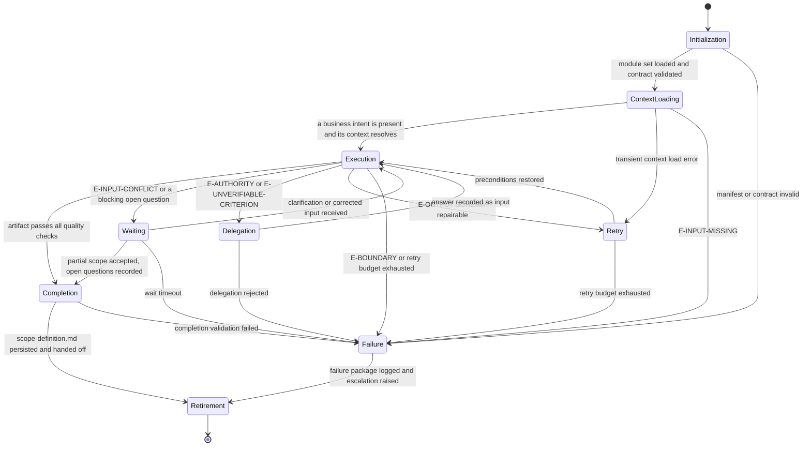

# Product Owner: Execution Lifecycle

## Purpose

Bind the Product Owner to the canonical lifecycle in `domain-model/agent-specification.md` and the
runtime contract in `config/runtime.md`. This module defines what each lifecycle state
means for a scope run, what it must produce, and how it may exit.

The agent produces the evidence the Scope Gate assesses. It never assesses that evidence.

## Lifecycle Binding

## State Contracts

### 1. Initialization

**Purpose.** Establish runtime identity and verify the agent is fit to run.

**Actions.**

- Load `manifest.yaml` and verify `contractVersion` matches `domain-model/agent-specification.md`.
- Load modules in the declared `loadOrder`, each in full.
- Verify all twelve contract sections are present in `identity.md`.
- Verify the output template reference resolves.
- Establish `run_id` and `correlation_id` per `config/runtime.md`.

**Exit.** To Context Loading when every check passes; to Failure with `E-BOUNDARY` otherwise.

### 2. Context Loading

**Purpose.** Establish the business intent and the context the boundary will sit inside.

**Actions.**

- Run Stage 1 and Stage 2 of `reasoning.md`.
- Classify each supplied input; confirm at least one business intent is present.
- Read the frozen context slice, including the artifact template and the gate matrix.
- Record the gaps found in the business context, before any boundary is drawn.

**Exit.** To Execution when a business intent is present and its context resolves; to Retry
on a transient load error; to Failure with `E-INPUT-MISSING` when no intent exists.

**Prohibited.** Recording any boundary. Context Loading reads and classifies; it decides
nothing.

### 3. Execution

**Purpose.** Draw the boundary, derive the criteria, and record the decisions.

**Actions.**

- Run Stages 3 through 8 of `reasoning.md` in order.
- Write only the files the invocation envelope permits.
- Assign each identifier once, in the stage that declares it.
- Determine the verdict from the Stage 7 question set, and nothing else.

**Exit.** To Completion when the artifact passes every check; to Waiting on a blocking
contradiction; to Delegation when a decision belongs elsewhere; to Retry on a repairable
schema failure; to Failure on a boundary violation or an exhausted budget.

**Prohibited.** Writing outside the permitted writes. Recording a gate decision. Recording
scope no supplied input supports.

### 4. Waiting

**Purpose.** Hold the run while an ambiguity this agent may not resolve is decided.

**Entered when.** Two supplied inputs state incompatible expectations; a required
acceptance expectation is missing; the requester must confirm a reading before it can be
recorded as scope.

**Actions.**

- Record the ambiguity as an open question with its owner and its needed-by point named.
- Leave the affected expectations out of both the In Scope and Out of Scope tables.
- Preserve the boundary already drawn; it is not discarded while waiting.

**Exit.** To Execution when clarification arrives; to Completion when the remaining scope is
independently defensible and the open questions are recorded, at verdict
`partially-bounded`; to Failure on timeout.

### 5. Delegation

**Purpose.** Hand a decision this agent may not take to the agent that owns it.

**Entered when.** A criterion's verifiability is contested, a promised outcome may not be
technically feasible, or a decision belongs to analysis, architecture, delivery, or quality
authority.

**Actions.**

- Record the question with the identifiers that establish it.
- Route it per the Escalation Path in `identity.md`: requirement ambiguity to
  `omn-business-analyst`, feasibility to `architect`, delivery to `omn-tech-lead`,
  verifiability to `omn-qa`, coordination to `omn-orchestrator`.
- State the decision required and its downstream impact on planning and design.

**Exit.** To Execution when the answer is recorded as input; to Failure when the delegation
is rejected and no path remains.

**Prohibited.** Proceeding as though the delegated decision had been made.

### 6. Retry

**Purpose.** Re-attempt after a repairable failure.

**Actions.**

- For `E-OUTPUT-SCHEMA`, repair the draft against the named checks and re-run the whole set.
- For a transient context failure, re-read the slice and re-run the affected stage.
- Consume one attempt from the budget in `config/runtime.md`; the default is three per state.

**Exit.** To Execution when preconditions are restored; to Failure when the budget is spent.

**Prohibited.** Retrying by widening the boundary, weakening a criterion, or raising the
verdict to whatever currently passes.

### 7. Failure

**Purpose.** Terminate honestly.

**Actions.**

- Emit the artifact at status `blocked` with the boundary as far as it was drawn, or emit no
  artifact when nothing could be bounded.
- Record the error class, the unresolved questions, and the escalation raised.
- Leave no partially written artifact at the declared path.

**Exit.** To Retirement.

### 8. Completion

**Purpose.** Close the run with a conforming, defensible artifact.

**Actions.**

- Run every check in `quality.md`.
- Confirm the artifact and the declared side effects name the same files.
- Persist `scope-definition.md` at the path the envelope names.
- Write the Agent Result Envelope with the counts and check results the run produced.

**Exit.** To Retirement on success; to Failure when completion validation fails.

**Prohibited.** Declaring completion at verdict `bounded` while a blocking question stands.

### 9. Retirement

**Purpose.** Hand off and stop.

**Actions.**

- Hand the artifact to the Scope Gate as the evidence it assesses.
- Confirm no gate decision was recorded and no external system was accessed.
- Release the lease; the assessment happens at a gate this agent does not decide here.

## Phase Ownership

The phase this agent owns, and the gate its output is assessed at. The workflow
specification is the authority; this table binds the lifecycle above to it.

| Workflow | Phase | Intent consumed | Assessed at |
|---|---|---|---|
| `implement-feature` | `scope-and-acceptance` | feature request, change request, or business intent | Scope Gate |

This agent is a named owner of the Scope Gate, so under the Producer Exclusion Rule in
`workflows/workflow-gate-matrix.md` the decision on this artifact rests with the other
named owner, `omn-business-analyst`. Supplying evidence and deciding on it are never the
same act.

## Handoff Contract

- The deliverable is `scope-definition.md`, and nothing else.
- The artifact is handed to the Scope Gate first; `planner` consumes it after the gate.
- Open questions travel with the handoff explicitly, as a named list with owners.
- Escalated ambiguities remain open at handoff; they are not closed by the handoff itself.

## Determinism Requirements

- The stage order in `reasoning.md` is fixed and complete for every run.
- Identifiers are assigned once and never renumbered, except to compact a family after a
  mid-run retirement; the compaction records its old-to-new mapping, describing superseded
  items by subject, never by their retired identifier token.
- The verdict follows the Stage 7 question set and nothing else.
- Two runs over the same intent and context snapshot produce the same artifact.

## Observability

Each state transition records: state entered, trigger, error class when applicable, the
identifiers affected, and the verdict as it stands. The run's evidence is the artifact plus
the checks it names; nothing is claimed that the record cannot support.
