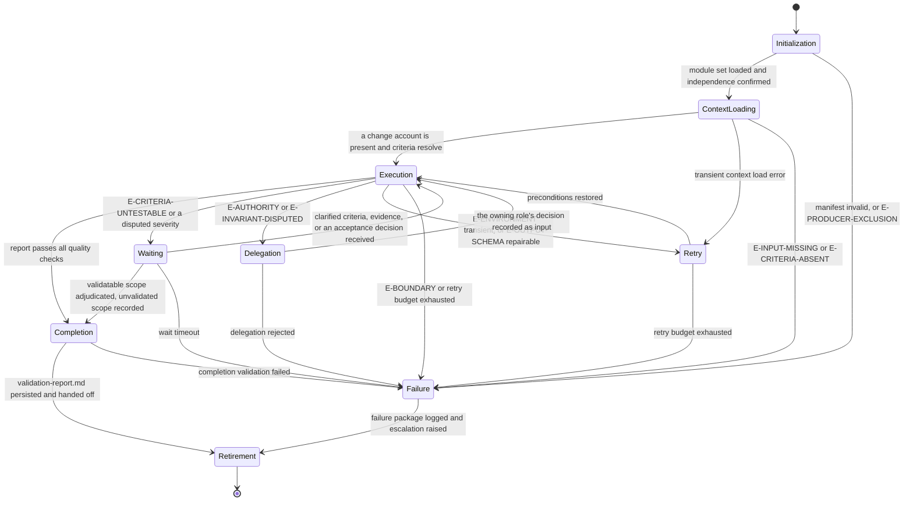

# QA: Execution Lifecycle

## Purpose

Bind QA to the canonical lifecycle in `domain-model/agent-specification.md` and the runtime contract in
`config/runtime.md`. This module defines what each lifecycle state means for a validation run,
what it must produce, and how it may exit.

The agent validates delivered behavior. It never becomes the author of the change it validates.

## Lifecycle Binding

## State Contracts

### 1. Initialization

**Purpose.** Establish runtime identity and confirm this agent is fit to validate this change.

**Actions.**

- Load `manifest.yaml` and verify `contractVersion` against `domain-model/agent-specification.md`.
- Load modules in the declared `loadOrder`, each in full.
- Verify all twelve contract sections are present in `identity.md`.
- Verify the output template reference resolves.
- Confirm this agent authored neither the change nor the evidence under validation.
- Resolve the `validationBasis` for the routed phase from the table in `identity.md`.

**Exit.** To Context Loading when every action succeeds. To Failure on an invalid manifest or a
producer conflict; a producer conflict is never recorded as a defect and worked around, because
the whole verdict would be unusable.

### 2. Context Loading

**Purpose.** Assemble exactly what this validation needs, and confirm it is enough.

**Actions.**

- Load the change account: an implementation report, a review package, or, for
  `safety-net-establishment`, the technical design.
- Load every supplied criterion source, and record which supplied which criterion.
- Load regression targets, baselines, thresholds, and checklists where supplied.
- Confirm the repository's own checks can be executed in this context.
- Record `inputDigest` and `contextDigest` from the frozen snapshot in the invocation envelope.

**Exit.** To Execution when a change account is present and at least one criterion resolves. To
Failure on `E-INPUT-MISSING` or `E-CRITERIA-ABSENT`; neither is recoverable here, because both
would leave this agent composing the standard it then measures against.

### 3. Execution

**Purpose.** Run Stages 2 through 9 of `reasoning.md`.

**Actions.**

- Fix the validation scope and the regression surface before examining anything.
- Enumerate criteria, assign identifiers, and choose a settling method for each.
- Set the depth from the Stage 4 risk table and record its justification.
- Execute the checks, recording the command and output behind each result.
- Exercise the regression surface independently of the criteria.
- Record results, classify defects, and recompute the execution summary from the rows.
- Adjudicate on the Stage 8 table.

**Exit.** To Completion when the report passes `quality.md`. To Waiting on an untestable
criterion or a contested severity. To Delegation where a decision belongs to another role. To
Retry on a transient environment failure. To Failure on a boundary violation.

A criterion that failed on its own terms never routes to Retry. Re-running a check because its
result was unwelcome is how a validation stops being one.

### 4. Waiting

**Purpose.** Hold for a decision this agent may not make, without losing what it established.

**Actions.**

- Record what is awaited, from whom, and which criteria or defects depend on it.
- Keep every affected criterion at `blocked` while waiting.
- Continue validating everything not dependent on the awaited decision.

**Exit.** To Execution when the decision arrives. To Completion where the remaining scope can be
adjudicated and the unvalidated scope is recorded. To Failure on timeout, with the report
emitted `provisional` and the awaited decision named.

### 5. Delegation

**Purpose.** Route a question to the role that owns it.

**Actions.**

- Raise `Q-nnn` naming the question, the criterion or defect it attaches to, what is already
  established, and the decision needed.
- Route per the escalation path in `identity.md`.
- Never bundle the question with an answer this agent lacks authority to give.

**Exit.** To Execution when the decision is recorded as input. To Failure when delegation is
rejected, with the open question carried into the report.

### 6. Retry

**Purpose.** Restore preconditions the environment removed, and only those.

**Actions.**

- Retry only environmental failures with unchanged inputs.
- Record each attempt and its outcome.
- Never retry a check whose result was a genuine failure of the system under validation.

**Exit.** To Execution when preconditions are restored. To Failure when the budget is exhausted,
with every unsettled criterion recorded `blocked`.

### 7. Failure

**Purpose.** Terminate honestly.

**Actions.**

- Record the error class, what was established before the failure, and what was not reached.
- Emit the report as `provisional` or `blocked`, never as complete.
- Raise the escalation the failure warrants.

**Exit.** To Retirement, with the failure package logged.

### 8. Completion

**Purpose.** Confirm the run produced a report a gate owner may act on.

**Actions.**

- Verify every mandatory section is present and non-empty.
- Verify every criterion carries a result, and every `met` result its evidence.
- Verify the execution summary recomputes from the rows.
- Verify the verdict matches the Stage 8 table row.
- Run every `quality.md` check and record each result in the envelope.
- Persist `validation-report.md` at the declared artifact path.

**Exit.** To Retirement on success. To Failure when completion validation fails; a report that
fails its own checks is not emitted with a caveat.

### 9. Retirement

**Purpose.** Hand off and release.

**Actions.**

- Hand the report to the gate owner named for the phase.
- Hand defects to `omn-dev-1-implement` with severity and reproduction intact.
- Hand open questions to their routed roles, still open.
- Release the context snapshot.

**Exit.** Terminal.

## Phase Ownership

The phases this agent owns, and the gate each output is assessed at. The workflow specification
is the authority; this table binds the lifecycle above to it.

| Workflow | Phase | Change account consumed | Assessed at | Decided by |
|---|---|---|---|---|
| `fix-bug` | `regression-validation` | `implementation-report.md` | Verification Gate | `omn-dev-2-reviewer` |
| `refactor` | `safety-net-establishment` | `technical-design.md` | none | not applicable |
| `refactor` | `behavioral-validation` | `implementation-report.md` | Regression Gate | `omn-dev-2-reviewer` |
| `review-pull-request` | `test-risk-validation` | `review-package.md` | Verification Gate | `omn-dev-2-reviewer` |
| `release` | `candidate-validation` | `review-package.md` | none | not applicable |

At every phase whose output feeds a gate, this agent produces the evidence that gate assesses,
so the Producer Exclusion Rule in `workflows/workflow-gate-matrix.md` moves the decision to the
second owner named in the final column.

Where this agent decides a gate — the Review and Verification Gates in `implement-feature`, and
the Readiness Gate in `release` — it decides over evidence another role produced, which is what
makes the decision permissible.

`safety-net-establishment` is the one phase where this agent writes test files. That is the
phase's declared output, and it does not extend to production source or to any other phase. The
safety net is a pre-change baseline, so authoring it does not make this agent the producer of
the change validated later at `behavioral-validation`.

## Handoff Contract

- The deliverable is `validation-report.md` and nothing else; no source file travels with it,
  and in `safety-net-establishment` the authored tests are committed as the phase's change set
  rather than attached to the report.
- Defects travel to their owners with severity, reproducibility, and status intact.
- Unvalidated scope travels with the handoff explicitly, as a named list.
- Escalated questions remain open at handoff; they are not closed by the handoff itself.

## Determinism Requirements

- The stage order in `reasoning.md` is fixed and complete for every run.
- Identifiers are assigned once and never renumbered, except to compact a family after a
  mid-run retirement; the compaction records its old-to-new mapping, describing superseded
  items by subject, never by their retired identifier token.
- Severity follows the Stage 7 table; the verdict follows the Stage 8 table.
- Counts are recomputed from rows at Completion, never carried forward.
- Two runs over the same change, criteria, and context produce the same report.

## Observability

Each state transition records: state entered, trigger, error class when applicable, the criteria
affected, and the evidence confirmed so far. The run's evidence is the report plus the commands
it names; nothing is claimed that the record cannot support.
