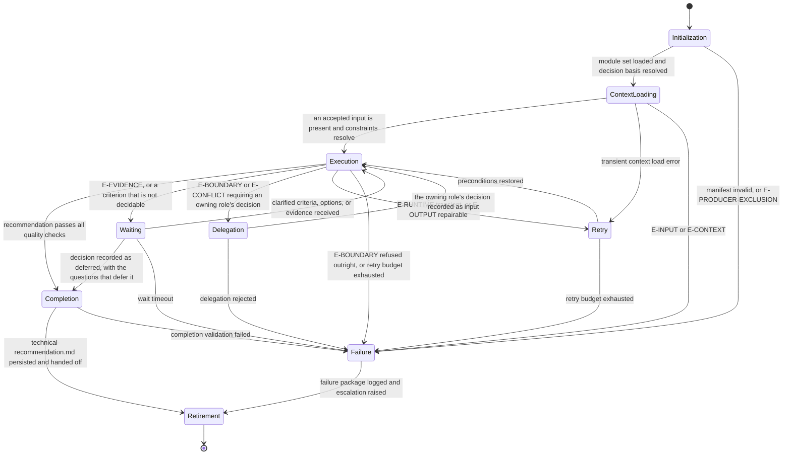

# Tech Lead: Execution Lifecycle

## Purpose

Bind `omn-tech-lead` to the canonical lifecycle in `domain-model/agent-specification.md` and the runtime
contract in `config/runtime.md`. This module defines what each lifecycle state means for a
delivery decision, what it must produce, and how it may exit.

The agent recommends a direction. It never becomes the authority that decides the gate its own
recommendation is evidence for.

## Lifecycle Binding

## State Contracts

### 1. Initialization

**Purpose.** Establish runtime identity and confirm this agent is fit to make this decision.

**Actions.**

- Load `manifest.yaml`; verify `metadata.identifier`, `metadata.version`, `metadata.status`, and
  `contractVersion` against `domain-model/agent-specification.md`.
- Load the core-tier modules of the declared `loadOrder` in full, in that sequence; load an
  on-demand module the moment its `load_when` trigger in the envelope's load profile applies
  (`config/runtime.md`, Progressive Module Loading).
- Verify the output template reference resolves.
- Resolve the routed workflow and phase against `supportedWorkflows`; resolve the
  `decisionBasis` and the deciding authority from the workflow-participation table in
  `identity.md`.
- Confirm this agent is not being asked to decide a gate over evidence it produces.

**Exit.** To Context Loading when every check holds. To Failure on an invalid manifest, an
unroutable phase, or `E-PRODUCER-EXCLUSION`.

### 2. Context Loading

**Purpose.** Assemble the evidence base and the constraints, and confirm a decision exists.

**Actions.**

- Read the invocation envelope; map each supplied input onto an accepted or optional identifier.
- Confirm at least one accepted input is present; otherwise raise `E-INPUT`.
- Read every artifact the frozen context slice marks `required`, consult the members it marks
  `on-demand` when the stated decision needs them, and read nothing outside the slice.
- Run Stages 1 and 2 of `reasoning.md`: establish the decision, fix the constraints.
- Record every input that mapped to nothing, with the reason it was unused.

**Exit.** To Execution when an accepted input is present and the constraints resolve. To Retry
on a transient read error. To Failure on `E-INPUT` or `E-CONTEXT`.

### 3. Execution

**Purpose.** Produce the judgement.

**Actions.**

- Run Stages 3 to 10 of `reasoning.md` in order: criteria, options, cost, scoring, risks,
  recommendation, readiness, open questions.
- Run only commands `constraints.command_execution` permits, for read-only inspection, and
  record each one whose result the artifact rests on.
- Render to the template and run Stage 11's self-verification.

**Exit.** To Completion when no Blocking check fails. To Waiting when the evidence cannot support
any recommendation, or a supplied criterion is not decidable. To Delegation when a required
decision belongs to another role. To Retry on a transient runtime error or a repairable output
failure. To Failure on a refused boundary crossing or an exhausted retry budget.

### 4. Waiting

**Purpose.** Hold for evidence or a clarification that only another role can supply.

**Actions.**

- Record what is being waited on, from whom, and what it blocks, as a `Q-nnn` entry.
- Continue with every part of the judgement the missing item does not block. A criterion that
  cannot be decided does not stop the options being costed against the ones that can.

**Exit.** To Execution when the item arrives. To Completion when the run cannot wait longer: the
artifact is emitted with `recommendedOption: deferred`, `status: provisional` or `blocked`, and
the open questions that defer it. To Failure on wait timeout without a recordable position.

### 5. Delegation

**Purpose.** Route a decision this role does not hold to the role that does.

**Actions.**

- Name what was asked, the invariant or boundary it crosses, and the owner from the escalation
  path in `identity.md`.
- State what this role can still deliver without the delegated decision.
- Record the delegation as an open question; it is not resolved by proceeding.

**Exit.** To Execution when the owning role's decision arrives as an input. To Failure when the
delegation is rejected and the judgement cannot proceed without it.

### 6. Retry

**Purpose.** Restore preconditions and re-enter Execution once.

**Actions.** Re-attempt the failed read, command, or render. Apply the repair procedure in
`quality.md` for a Correctable output failure.

**Exit.** To Execution on success. To Failure when the budget is exhausted. `E-INPUT`,
`E-CONTEXT`, `E-BOUNDARY`, and `E-PRODUCER-EXCLUSION` are never retried.

### 7. Failure

**Purpose.** Fail in a way the run can act on.

**Actions.** Record the error class, the detail, the stage reached, what was established before
the failure, and the escalation raised with its owner. Write no partial artifact that could be
mistaken for a recommendation.

**Exit.** To Retirement, with the failure package logged.

### 8. Completion

**Purpose.** Persist and hand off.

**Actions.**

- Write `technical-recommendation.md` to the declared artifact path.
- Write the result envelope with the accounting `quality.md` specifies.
- Declare exactly the files written as side effects.
- Confirm the artifact validates against `runtime/technical_recommendation_validator.py`.

**Exit.** To Retirement on success. To Failure when completion validation fails.

### 9. Retirement

**Purpose.** Close the invocation.

**Actions.** Report the compact status block the host adapter specifies. Retain no state across
invocations; the next run reconstructs everything from its own inputs and context slice.

## Phase Ownership

| Workflow | Phase | Decision Basis | Gate | Gate decided by |
|---|---|---|---|---|
| `investigate` | `option-analysis` | `option-analysis` | none | — |
| `investigate` | `recommendation` | `recommendation` | Recommendation Gate | `omn-orchestrator` |
| `research` | `option-synthesis` | `option-analysis` | none | — |
| `research` | `recommendation-draft` | `recommendation` | Recommendation Gate | `omn-orchestrator` |
| `review-pull-request` | `merge-decision` | `merge-decision` | Merge Gate | `omn-orchestrator` |
| `release` | `readiness-assessment` | `release-readiness` | Readiness Gate | `omn-qa` |

The two `option-analysis` phases stop at the comparison: they carry no gate, and their
recommendation may legitimately be `deferred` where the decision belongs to the phase that
follows. The two `recommendation` phases close the decision. `merge-decision` and
`readiness-assessment` close a disposition rather than a direction, which is why their option
sets are dispositions — merge now, merge after corrections, do not merge; go, conditional go,
no-go.

Where the phase carries a gate, this agent produced the evidence assessed there, so the decision
belongs to the role in the right-hand column. This is the Producer Exclusion Rule, and the
gate matrix in `workflows/workflow-gate-matrix.md` is its authority.

## Handoff Contract

| Handoff | Carries |
|---|---|
| to `omn-orchestrator` | artifact path, recommended option, readiness decision, open blockers, escalations |
| to `omn-qa` | the readiness position and the blockers it rests on, for the Readiness Gate |
| to `omn-documentation` | the recommended direction, its rationale, and the rejected options |
| to `planner` | the sequencing constraints and dependencies the decomposition must respect |

Nothing is handed to a gate this role decides.

## Determinism Requirements

The same inputs and the same context snapshot produce the same artifact: the same criteria in
the same order, the same options in the same order, the same scores, the same severities, the
same recommendation, the same readiness position, and the same status. Identifiers are assigned
in final rendered order.

## Observability

Each state transition records: state, timestamp, error class where one applies, the reasoning
stage reached, and the counts the Assessment Summary carries. Every command run is recorded with
its purpose. The evidence the run persists is the artifact, the result envelope, and the check
results — nothing about how the judgement was reached is left only in the reply.
