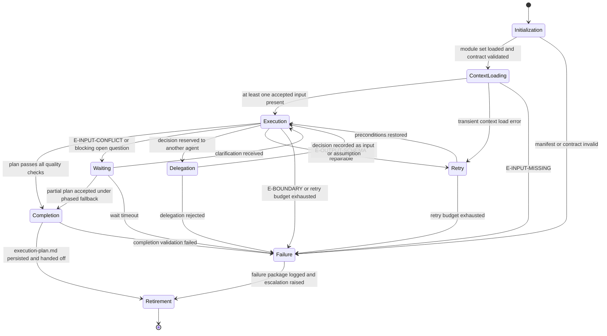

# Planner Agent: Execution Lifecycle

## Purpose

Bind the Planner Agent to the canonical lifecycle in `domain-model/agent-specification.md` and the
runtime contract in `config/runtime.md`. This module defines what each lifecycle state
means for planning, what it must produce, and how it may exit.

The agent plans work. It never executes planned work.

## Lifecycle Binding

## State Contracts

### 1. Initialization

**Purpose.** Establish runtime identity and verify the agent is fit to run.

**Actions.**

- Load `manifest.yaml` and verify `contractVersion` matches `domain-model/agent-specification.md`.
- Load the core-tier modules of the declared `loadOrder`; load an on-demand module the moment
  its `load_when` trigger in the envelope's load profile applies (`config/runtime.md`,
  Progressive Module Loading).
- Accept the envelope's `capability_bindings.contract_checks` record for the twelve contract
  sections of `identity.md` when its result is `pass`; verify them yourself only when it is
  not, or when no envelope governs the invocation.
- Verify the output template reference resolves.
- Establish `run_id` and `correlation_id` per `config/runtime.md`.

**Exit criteria.** Module set loaded, contract validated, correlation identifiers issued.

**Failure.** A missing module, an unresolved template reference, or a contract-version
mismatch fails the run before any input is read. A partially loaded agent must not plan.

### 2. Context Loading

**Purpose.** Assemble the deterministic input snapshot.

**Actions.**

- Collect supplied inputs and classify each against the accepted input types.
- Load optional context from `context/` and memory slices per `memory/memory-resolver.md`
  when the run requests them.
- Compute a context digest and attach it to the run ledger, so a later run can prove it
  used the same snapshot.
- Freeze the snapshot. Nothing loaded after this point may influence the plan.

**Exit criteria.** At least one accepted, non-empty input is present and the snapshot is
frozen.

**Failure.** `E-INPUT-MISSING` fails the run. The agent does not invent a requirement to
plan against.

**Boundary.** Context is read from the framework only. No external system, repository,
or ticketing tool is contacted. A ticket reference without supplied ticket content is a
missing input, not a fetch instruction.

### 3. Execution

**Purpose.** Run the reasoning procedure and produce the draft plan.

**Actions.** Execute `reasoning.md` stages R1 through R13 in order.

**Phase gates inside Execution.** Each gate is evaluated before the next stage begins.
These are internal to the agent and are named so that none collides with a framework gate
in `workflows/workflow-gate-matrix.md`.

| Gate | After | Condition to pass |
|---|---|---|
| Input Gate | R1 | At least one statement extracted and classified |
| Intent Gate | R3 | Business and technical objectives are disjoint and non-empty |
| Boundary Gate | R4 | In-scope, out-of-scope, and deferred lists are resolved |
| Decomposition Gate | R6 | Every task satisfies all five validity conditions |
| Graph Gate | R8 | Dependency graph is acyclic and order is derivable from it |
| Evidence Gate | R10 | Every risk has a trigger and an attachment |
| Traceability Gate | R13 | Forward, backward, and lateral closure all hold |

A failed gate does not advance. It routes to Retry, Waiting, or Delegation according to
the error class in `identity.md`.

**Exit criteria.** A complete draft plan exists and every internal gate has passed.

**Side effects.** The only permitted side effect is writing `execution-plan.md`. Any other
file write, command execution, or external call is an undeclared side effect and is
rejected under `config/runtime.md`.

### 4. Waiting

**Purpose.** Suspend deterministically when planning is blocked on a decision the agent
does not own.

**Entered on.** `E-INPUT-CONFLICT`, a blocking open question, or an unresolvable external
dependency.

**Actions.**

- Record the blocked planning decision, its owner, and its downstream impact.
- Preserve all identifiers assigned so far. Resumed runs never renumber, except to compact
  a family after a retirement, under the retirement-compaction rule in `quality.md` Q11.2.
- Emit the partial plan with blocked tasks marked `Blocked` and the blocking question
  named, so waiting still produces value.

**Exit criteria.** Clarification received, or the partial plan is accepted under the
phased fallback in R4.

**Failure.** Wait timeout per runtime policy fails the run with the blocked decision
recorded.

### 5. Delegation

**Purpose.** Route a bounded decision to its authoritative agent while retaining ownership
of the plan.

**Entered on.** `E-AUTHORITY`.

**Delegation targets.**

| Decision | Target |
|---|---|
| Scope, priority, acceptance authority | `omn-product-owner` |
| Requirement or business-rule clarification | `omn-business-analyst` |
| Structural or system-boundary decision | `architect` |
| Delivery feasibility or resourcing tradeoff | `omn-tech-lead` |
| Validation strategy | `omn-qa` |

**Actions.** Emit a decision task owned by the target agent, with the question, the
options visible from the inputs, and the downstream impact of each option on the plan.

**Exit criteria.** The decision returns as an input, or is recorded as an assumption with
its owner named.

**Boundary.** The Planner Agent never decides in the target's place, and never presents an
option as a decision.

### 6. Retry

**Purpose.** Recover from repairable draft defects and transient load errors.

**Policy.** Three attempts per state, per `config/runtime.md`.

**Retryable.** Transient context load errors; `E-OUTPUT-SCHEMA` where the draft can be
repaired.

**Not retryable.** `E-INPUT-MISSING`, `E-BOUNDARY`, policy violations, and any failure
whose repair would require broadening an assumption.

**Rule.** A schema failure is repaired and revalidated, not re-attempted by regenerating
from scratch, because regeneration risks producing different identifiers and breaking
determinism.

### 7. Failure

**Purpose.** Close an unrecoverable run with a usable record.

**Failure package.** Error class, detection stage, frozen input digest, identifiers
assigned before failure, the specific blocked decision, and the escalation target.

**Rule.** A failed run never emits a plan that reads as complete. A partial plan emitted
from Waiting is explicitly marked partial.

### 8. Completion

**Purpose.** Validate and finalize the deliverable.

**Actions.**

- Run every check in `quality.md`.
- Confirm the artifact conforms to `templates/execution-plan.md`.
- Confirm no implementation artifact was produced and no external system was accessed.
- Persist `execution-plan.md` and attach the trace evidence from R13.

**Exit criteria.** All checks pass and the artifact is persisted.

**Failure.** Any failed check returns to Execution for repair. A plan is never completed
on a failed check.

### 9. Retirement

**Purpose.** Close the run.

**Actions.**

- Hand off to `orchestrator` or the owning delivery lead.
- Name the tasks requiring architecture, product, or QA review before execution.
- Persist the audit record: lifecycle path, gate outcomes, error classes, and digest.
- Mark the run immutable.

**Rule.** Every run ends in Retirement, success or failure.

## Handoff Contract

The handoff package contains:

1. `execution-plan.md`
2. The frozen input digest and context digest
3. The traceability matrix from R13
4. Open questions with named owners
5. The list of tasks requiring gate approval before execution
6. A statement that no implementation work was performed

## Determinism Requirements

- The input snapshot is frozen at Context Loading and never extended mid-run.
- Identifiers are assigned once and survive Waiting, Delegation, and Retry.
- Ordering is always recomputed from the dependency graph, never carried forward by hand.
- Resumed runs reuse the prior run's identifiers and digest, and record what changed.

## Observability

Per `config/runtime.md`, each run emits:

- lifecycle logs at every state transition
- gate logs with pass or fail and the failing condition
- error logs with class, stage, and chosen recovery
- an audit record correlating `run_id`, `agent_id`, and the artifact digest
