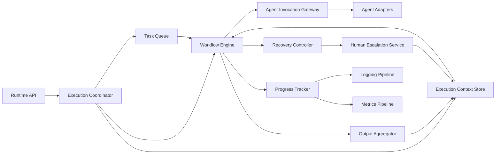
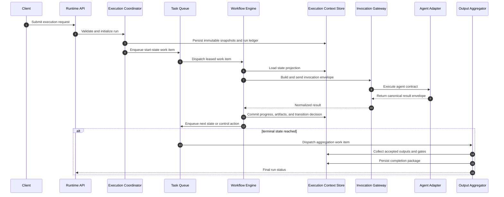
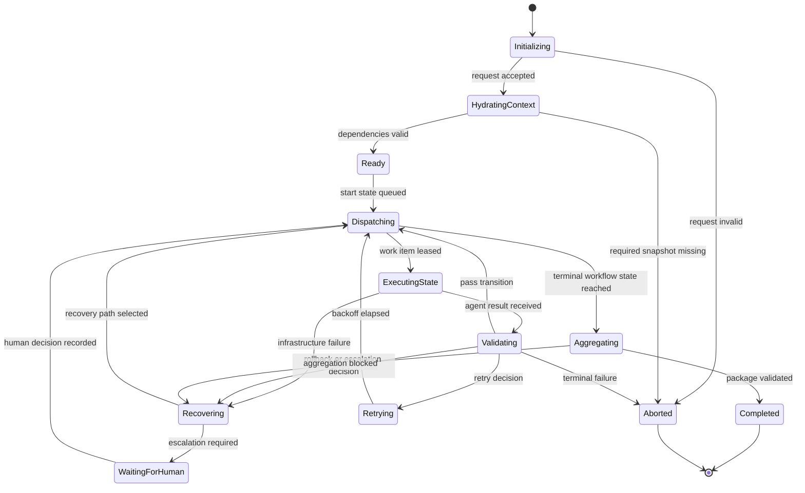
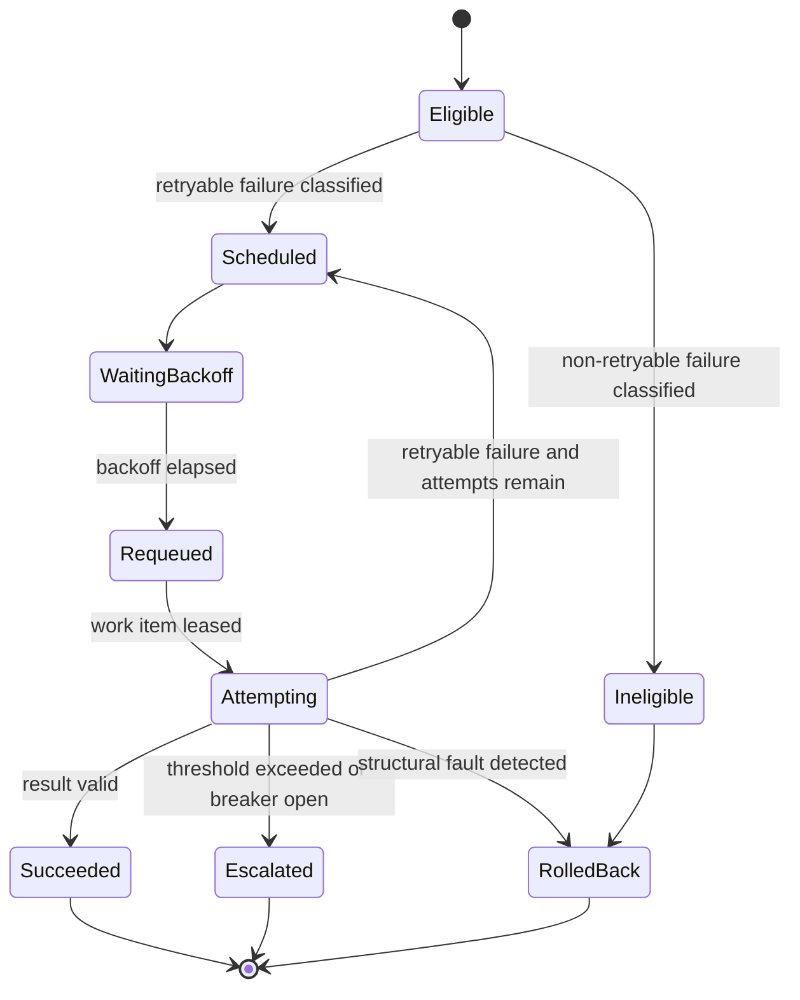

# Execution Engine Design

## Purpose

Define the extensible, model-agnostic runtime that coordinates AI agents through deterministic workflow execution, bounded retries, failure recovery, human escalation, and auditable output aggregation.

## Design Goals

- Keep orchestration independent from any specific AI model or vendor.
- Make workflow execution deterministic at the state-machine boundary.
- Preserve full auditability for every task, retry, rollback, escalation, and output.
- Support horizontal extension through registries, adapters, policies, and event subscribers.
- Separate immutable run inputs from mutable execution state.

## Non-Goals

- Defining prompt content for individual agents.
- Encoding workflow-specific business logic inside the runtime core.
- Binding orchestration directly to a single transport, storage engine, or model API.

## Architectural Principles

- Runtime core owns control flow; adapters own external integration.
- Workflow definitions are data-driven and version-locked per run.
- Agent invocations operate against stable contracts and typed envelopes.
- Recovery behavior is policy-driven, not hard-coded per agent.
- Human escalation is a first-class runtime path, not an out-of-band exception.

## Component Topology



## Core Runtime Contracts

### Execution Request

An execution request is the control-plane input that starts a run.

Required fields:

- `run_id`
- `correlation_id`
- `command_id`
- `workflow_id`
- `workflow_version`
- `intent`
- `requester`
- `priority`
- `requested_artifact_types`
- `policy_profile`

Optional fields:

- `deadline_at`
- `operator_notes`
- `external_references`
- `resume_from_run_id`

### Work Item

A work item is the queue-level unit scheduled for one workflow state or one runtime control action.

Required fields:

- `work_item_id`
- `run_id`
- `state_id`
- `work_type` (`state`, `gate`, `aggregation`, `escalation`, `recovery`)
- `owner_agent_id`
- `attempt`
- `lease_expires_at`
- `idempotency_key`
- `payload_digest`

### Execution Context

The execution context is the full run-scoped data contract available to the workflow engine and invocation gateway.

Immutable partitions:

- workflow definition snapshot
- context document snapshot
- memory snapshot
- active policy snapshot
- capability registry snapshot

Mutable partitions:

- state ledger
- artifact ledger
- progress ledger
- recovery ledger
- escalation ledger
- metrics counters

### Agent Invocation Envelope

Every agent invocation uses the same envelope regardless of backing model or toolchain.

- `invocation_id`
- `run_id`
- `state_id`
- `agent_id`
- `capability_bindings` (carrying `load_profile`, the core and on-demand module tiers with
  their triggers, and `contract_checks`, the Initialization checks the runtime performed)
- `skill_dispatch` (per skill code: `required` or `not-triggered`, with its basis)
- `input_contract`
- `task_context` (path, digest, and size of the run's task context, and the affected areas
  it derived)
- `upstream_artifacts` (each with its size and the sections to read first and on demand)
- `parallel_group` (the phases that may be dispatched alongside this one)
- `context_slice` (each member with a read hint: `required`, `on-demand`, `runtime-resolved`)
- `memory_slice`
- `constraints`
- `timeout_profile`
- `expected_output_schema`
- `context_budget` (byte estimate of what the dispatch asks the agent to read, under the
  legacy and the progressive rules)
- `model_tier` (resolved tier, host model hint, basis, and the escalation record when the phase
  was promoted after a recorded rejection; see `config/runtime.md`, Model Tiers)

Fields added by runtime 0.7.0, and `model_tier` added by runtime 0.9.0, are additive: an
envelope consumer that reads only the original eleven fields reads them unchanged.

### Agent Result Envelope

- `invocation_id`
- `status` (`succeeded`, `retryable_failure`, `rollback_required`, `escalation_required`, `terminal_failure`)
- `artifact_refs`
- `structured_output`
- `evidence_refs`
- `confidence`
- `declared_side_effects`
- `error_class`
- `error_detail`

## Task Queue

The detailed queue lifecycle, transition rules, and dispatch semantics are defined in `task-queue.md`.

### Responsibilities

- Accept work items emitted by the execution coordinator and workflow engine.
- Prioritize work by run priority, workflow urgency, gate criticality, and retry age.
- Lease work items to workers with explicit visibility timeout.
- Enforce idempotent re-dispatch using `idempotency_key`.
- Separate execution work from recovery and escalation work to avoid starvation.

### Queue Model

The queue uses four logical lanes:

1. `interactive-high`
2. `standard-state`
3. `recovery-control`
4. `human-escalation`

Dispatch order:

- higher lane priority first
- then earliest deadline
- then lowest remaining slack
- then FIFO within identical priority keys

### Lease and Acknowledgement Rules

- Work is never deleted at dispatch time; it is acknowledged only after ledger commit.
- Lease renewal is explicit and recorded as a progress event.
- Expired leases produce one of two outcomes: reclaim for retry or mark worker loss and trigger recovery classification.
- Queue consumers must be stateless; the execution context store is the source of truth.

### Queue Extension Points

- custom priority strategy
- alternate queue backends
- queue event subscribers
- workflow-specific scheduling hints

## Execution Context

### Context Assembly

The execution coordinator assembles context in this order:

1. runtime request metadata
2. workflow definition and state contracts
3. routing and policy configuration
4. context snapshots
5. memory snapshots
6. previous-run lineage, when resuming or replaying

### Context Narrowing

The runtime must reduce the full context into state-local slices before invocation.

Narrowing rules:

- include only sections referenced by the current state contract
- include only memory categories allowed by policy and relevance rules
- include parent-state outputs referenced by transition dependencies
- include unresolved risks and open escalations for the run
- carry the run's established facts once, in the task context (`config/runtime.md`, Task
  Context), and name for each parent-state output the sections to read first, so a state
  does not re-derive what an accepted upstream artifact already decided
- mark every frozen context member with a read hint and every resolved skill with a dispatch
  verdict; a member or skill the state does not need stays in the provenance record and out
  of the agent's reading

### Context Integrity

- Every immutable partition is content-addressed by digest.
- The run ledger stores both snapshot identity and normalized schema version.
- State execution must fail fast when a required context partition is missing or incompatible.
- Mutable partitions are append-only by event, with derived projections for fast reads.

## Agent Invocation

### Invocation Pipeline

1. Resolve owner agent from workflow state contract.
2. Bind required capabilities, skills, and tool policies.
3. Build invocation envelope from state payload and narrowed context.
4. Select adapter based on agent contract, not model type.
5. Execute within timeout, token, and side-effect constraints.
6. Validate result envelope against expected schema.
7. Persist artifacts and emit progress event.

### Model-Agnostic Adapter Contract

The runtime core interacts with adapters through a stable service provider interface.

Adapter responsibilities:

- accept canonical invocation envelope
- transform to provider-specific request shape
- normalize provider responses into canonical result envelope
- surface transport or provider failures as runtime error classes
- emit usage telemetry without exposing provider-specific semantics to the workflow engine

Runtime restrictions:

- no workflow logic inside adapters
- no direct dependency from the state engine to a model SDK
- no provider-specific fields in workflow definitions

### Invocation Policies

- One primary agent owns one active state execution.
- Secondary agents participate only through gates, reviews, escalation, or evidence requests.
- An invocation may produce proposed side effects, but side effects are committed only after validation and policy approval.
- Two state work items whose hard predecessors have all committed may hold leases at the same
  time. The runtime already refuses to lease a phase before its hard predecessors commit and
  refuses two writers of one artifact path, so "eligible" is exactly "safe to run alongside
  every other eligible phase". A phase whose only unmet predecessor is soft may start early;
  the runtime reports that it forgoes the predecessor's artifact, and the default sequence
  waits.

### Artifact Economy

An artifact is judged by the Validation Engine on structure and traceability, never on
length. Every agent therefore renders every section and row its output contract requires,
complete, and nothing more:

- state each fact once and cite it by identifier afterwards;
- keep a table cell to one line;
- reference a supplied input or an upstream artifact by identifier and digest rather than
  restating it;
- add no appendix, preamble, or narrative the output contract does not require;
- record what was executed, decided, and left open, not the reasoning that led there, unless
  the contract asks for the rationale.

The dispatch prompt carries this policy verbatim. It narrows nothing an output contract
requires; it removes what no contract asks for.

## Workflow Execution

### Execution Semantics

- Each run is a deterministic state machine locked to one workflow version.
- Only one workflow state is active at a time for a single run.
- State transition is atomic: result classification, ledger write, and queue emission either all commit or none commit.
- Gates are explicit control states and never implicit post-processing.

### Workflow Loop

1. Dequeue current work item.
2. Load execution context projection for the state.
3. Invoke owner agent or control component.
4. Validate exit criteria and output schema.
5. Classify outcome as `pass`, `retry`, `rollback`, `escalate`, or `abort`.
6. Persist all events.
7. Enqueue next work item.

### Execution Sequence



### Run Lifecycle State Model



## Progress Tracking

The detailed agent execution progress model and timeline representation are defined in `progress-model.md`.

### Progress Event Model

Progress is event-based, not inferred only from current state.

Required event fields:

- `event_id`
- `run_id`
- `work_item_id`
- `event_type`
- `timestamp`
- `actor_type` (`runtime`, `agent`, `human`)
- `actor_id`
- `state_id`
- `summary`
- `details_ref`

### Canonical Event Types

- `run_initialized`
- `context_hydrated`
- `work_item_enqueued`
- `work_item_leased`
- `invocation_started`
- `invocation_completed`
- `validation_passed`
- `validation_failed`
- `retry_scheduled`
- `rollback_scheduled`
- `escalation_opened`
- `escalation_resolved`
- `aggregation_completed`
- `run_completed`
- `run_aborted`

### Progress Projections

The tracker publishes three views:

- operator timeline
- workflow-state summary
- SLA and latency dashboard feeds

## Retry

### Retry Eligibility

Retries are permitted only for errors classified as transient or remediable without state rewinding.

Retryable examples:

- temporary adapter transport failure
- bounded tool timeout
- schema-correctable output omission
- external dependency saturation

Non-retryable examples:

- policy violation
- missing mandatory context
- structural contradiction in state output
- explicit human rejection at a gate

### Retry Policy Model

Each workflow state can reference a retry profile with:

- `max_attempts`
- `backoff_strategy`
- `base_delay`
- `max_delay`
- `jitter_ratio`
- `timeout_growth`
- `circuit_breaker_threshold`

### Retry State Model



## Failure Recovery

### Failure Classification Matrix

| Failure Class | Detection Point | Default Action | Escalation Trigger |
|---|---|---|---|
| Request validation failure | initialization | abort | none |
| Context integrity failure | hydration | abort | repeated source corruption |
| Invocation transport failure | adapter boundary | retry | circuit breaker open |
| Output schema failure | validation | retry or rollback | repeated malformed output |
| Workflow contract violation | validation | rollback | second occurrence in same run |
| Gate rejection | gate state | rollback (human-authorised supersession; see below) | repeated gate failure without deterministic remediation |
| Aggregation conflict | aggregation | remediation then escalate | critical conflict persists |
| Worker loss or lease expiry | queue control | retry | repeated worker loss |

### Recovery Controller Responsibilities

- classify the failure using policy and state metadata
- compute the least-destructive valid recovery action
- create recovery work items when rollback or remediation is needed
- record human-action requirements when automation cannot safely proceed
- prevent infinite recovery loops through breaker and attempt thresholds

### Rollback After a Gate Rejection

A gate rejection is classified `rollback`, and the rollback is a second human decision rather
than a consequence of the first: the rejection's failure envelope demands a
`rollback-authorisation`, and only a listed, non-producing owner of the rejected gate may
record one. The runtime represents an authorised rollback as **supersession in the state
model**, never as a rewrite of committed evidence:

- The authoriser names the rollback target: the phase the gate closes, or a completed hard
  predecessor of it. Rationale text is never parsed for a target or an owner.
- The supersession range is the target's completed downstream cone: the target and every
  completed phase that transitively hard-depends on it. The closed phase is always in it, and
  so is a completed dependent off the closed phase's own ancestor chain (in `fix-bug`,
  `root-cause-analysis` when the target is `triage-and-impact`), which a walk back from the
  closed phase would leave standing on superseded evidence. Every phase in the range is
  superseded under one authorisation id. A superseded phase moves `completed -> pending`
  (trigger `superseded`) and
  keeps its idempotency key: the next attempt is the same unit of work. Its prior completion
  record moves unmodified into the work item's append-only `supersessions` list, and the new
  attempt writes its artifact into an attempt-scoped directory beneath the phase's artifact
  directory, so a committed artifact is never rewritten. The rejection travels into the new
  attempt's invocation envelope as `prior_rejection`, as data for the agent to rebuild against.
- The rejected gate moves `failed -> pending` (trigger `rollback_authorised`) on the same work
  item. The rejection is appended to the gate record's `decision_history`, the decision returns
  to null, and the gate is decided again by a human once the rebuilt evidence lands; a gate
  carrying a decision history is never auto-approved. The rejection's transition, event, and
  envelope are preserved; the envelope is marked resolved naming the authorisation.
- The re-entered attempt is charged against the phase's retry budget. When a phase in range
  has no charged attempt left the authorisation is refused, which is the escalation trigger
  "repeated gate failure without deterministic remediation".
- No approved gate may stand over any phase in the range, the closed phase included. A
  completed gate cannot be re-armed within the two authorised exits, so the authorisation is
  refused and the store is left unchanged; the remedy is a shallower target, or a new run.
  While a rejection stands, `next` names the rollback command first, derived from the live
  store, offers no decision on another gate closing the rejected phase, and the auto-approval
  policy holds such a gate for a human; `recovery` derives the clearing action of an open
  gate-rejection envelope live rather than echoing the recorded text, which stays as written.
  The clearing action names the role that rejected and leaves the authoriser a placeholder:
  who authorises is never defaulted from who rejected.
- These two transitions are the only exits from a terminal status, and the state engine
  refuses `superseded` unless the supersession record accompanies it.

### Recovery Sequence

```mermaid
sequenceDiagram
  autonumber
  participant Engine as Workflow Engine
  participant Recovery as Recovery Controller
  participant Queue as Task Queue
  participant Human as Human Escalation Service
  participant Context as Execution Context Store

  Engine->>Recovery: Report classified failure
  Recovery->>Context: Append recovery event and attempt counters
  alt retry allowed
    Recovery->>Queue: Enqueue retry work item with backoff
  else rollback required
    Recovery->>Human: Open escalation case demanding a rollback authorisation
    Human->>Context: Record the authorisation and the rollback target state
    Recovery->>Queue: Supersede the target's completed downstream cone (every completed hard-dependent, gated phase included); re-arm the gate
  else human escalation required
    Recovery->>Human: Open escalation case with evidence
    Human->>Context: Record decision and remediation instructions
    Human->>Queue: Enqueue resumed work item
  else abort required
    Recovery->>Context: Mark run aborted with rationale
  end
```

## Human Escalation

### Escalation Triggers

- ambiguity the workflow cannot resolve within retry budget
- repeated gate failure without deterministic remediation
- conflict between authoritative outputs
- policy exception request
- unsafe or high-impact side effect requiring approval

### Escalation Contract

Each escalation case must include:

- `escalation_id`
- `run_id`
- `state_id`
- `reason_code`
- `required_decision_type`
- `deadline_at`
- `evidence_bundle_ref`
- `proposed_options`
- `default_fallback_action`

### Human Decision Outcomes

- approve proposed path
- reject (a gate decision), then authorise the rollback (a second decision on the same gate)
- request additional evidence
- reassign agent or owner
- abort run

Human decisions are persisted as first-class ledger events and can trigger new queue items.

## Logging

### Logging Principles

- Structured logs only.
- Every log line must include `run_id`, `correlation_id`, and component identifier.
- Sensitive inputs, secrets, and restricted memory content must be redacted before emission.
- Logs are append-only and immutable after retention lock.

### Required Log Streams

- control-plane request log
- queue scheduling log
- invocation audit log
- recovery and escalation log
- aggregation log
- policy decision log

### Minimum Log Schema

- `timestamp`
- `severity`
- `component`
- `run_id`
- `correlation_id`
- `state_id`
- `event_type`
- `message`
- `metadata`

## Metrics

### Core Service Metrics

- run start rate
- active runs by workflow
- queue depth by lane
- work-item lease expiry count
- invocation success rate
- retry rate by state and agent
- rollback rate by workflow
- escalation rate and time-to-decision
- aggregation completion latency
- run completion SLA attainment

### Quality Metrics

- malformed output rate
- gate rejection rate
- repeated failure rate per workflow version
- policy violation rate
- residual risk count at completion

### Metric Dimensions

- workflow id
- workflow version
- state id
- agent id
- policy profile
- priority lane
- failure class

## Output Aggregation

### Aggregation Role in the Runtime

Output aggregation is the terminal packaging stage for accepted workflow outputs. It must remain decoupled from workflow execution so aggregation can be retried, audited, or replaced independently.

### Aggregation Inputs

- accepted state outputs
- gate decisions and rationale
- evidence references
- escalation records
- recovery history
- template and schema requirements

### Aggregation Rules

- accept only schema-validated artifacts
- preserve original provenance for every included section
- block finalization on unresolved critical conflicts
- emit both human-readable package and machine-readable manifest

### Aggregation Outputs

- completion package
- manifest with provenance index
- residual risk summary
- unresolved non-blocking follow-up items
- aggregation audit record

The detailed artifact merge design is defined in `.claude/config/output-aggregator.md` and is a subordinate specification to this runtime design.

## Extensibility Model

### Stable Extension Surfaces

- workflow registry
- agent registry
- skill registry
- adapter provider interface
- queue backend adapter
- policy evaluators
- event subscribers
- output publishers
- metrics exporters

### Extension Rules

- Extensions may add capabilities but may not alter canonical ledger semantics.
- New adapters must map to canonical invocation and result envelopes.
- Workflow additions must declare explicit retry, rollback, and escalation behavior.
- Policy extensions must be versioned and backward-compatible or provide migration guidance.

## Deployment and Scaling Guidance

- Scale queue consumers horizontally; keep orchestration state centralized in the execution context store.
- Prefer event replay and projection rebuild over mutable in-place state repair.
- Isolate high-latency agent adapters from control-plane services.
- Keep aggregation and escalation workers independently scalable from state execution workers.

## Acceptance Criteria

The execution engine design is complete only when all statements are true:

- The runtime can execute any registered workflow without model-specific orchestration logic.
- Every state transition produces a durable audit trail.
- Retry, rollback, escalation, and abort paths are explicit and policy-controlled.
- Human intervention can pause and resume runs without breaking determinism.
- Outputs are aggregated into one traceable completion package.
- New agents, workflows, adapters, and metrics sinks can be added without changing the runtime core contract.