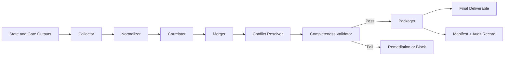

# Output Aggregator Specification

## Purpose

Define the runtime component that combines outputs from multiple agents into one deterministic, traceable, and publishable deliverable for each workflow run.

## Scope

The Output Aggregator is responsible for:

- collecting state and gate outputs from all participating agents
- normalizing artifacts into a canonical schema
- resolving overlap and contradiction across outputs
- preserving provenance and decision traceability
- producing one final completion package per run

## Design Principles

- Deterministic: identical inputs produce identical final packages.
- Lossless provenance: original source output is never discarded.
- Policy-first: governance and quality rules override preference-based merges.
- Minimal ambiguity: unresolved conflicts are explicit and block finalization.

## Inputs

- run metadata (run id, workflow id, workflow version, correlation id)
- workflow state ledger and transition history
- agent outputs per state (primary and secondary)
- gate decisions and approver rationale
- evidence artifacts (tests, logs, reports, references)
- applicable template definitions and output schemas

## Outputs

- single aggregated deliverable package
- manifest of all included artifacts
- unresolved items and residual risks
- completion status and validation results
- immutable audit record for the aggregation process

## Aggregator Architecture

### Components

- Collector: ingests outputs emitted by state executions and gates.
- Normalizer: maps heterogeneous outputs into canonical artifact envelopes.
- Correlator: links artifacts to state, agent, and dependency identifiers.
- Merger: combines compatible artifacts and sections by merge policy.
- Conflict Resolver: handles contradiction, duplication, and priority disputes.
- Completeness Validator: checks required sections, evidence, and gates.
- Packager: builds final deliverable and machine-readable manifest.
- Publisher Adapter: writes package to configured sink(s).

### High-Level Flow

## Canonical Artifact Model

Every artifact is wrapped in a standard envelope:

- artifact id
- artifact type
- workflow state id
- producer agent id
- produced timestamp
- schema version
- content payload
- evidence references
- confidence and validation metadata

This envelope enables deterministic merge and end-to-end traceability.

## Collection Strategy

- Collect artifacts at each state exit and each gate decision.
- Accept only schema-validated payloads into merge queue.
- Preserve failed payloads in side-channel audit storage for diagnostics.
- Enforce idempotent ingestion using artifact fingerprints.

## Normalization Rules

- Map equivalent artifact aliases to one canonical type.
- Convert free-form sections into typed fields when template mappings exist.
- Attach default metadata for missing optional fields.
- Reject artifacts missing mandatory provenance fields.

## Merge Strategy

### Merge Levels

1. State-local merge
- combine outputs produced within the same workflow state

2. Phase-level merge
- combine outputs from related states within the same workflow phase

3. Run-level merge
- compose final deliverable from all validated phase outputs

### Merge Policies

- Append-only for logs, evidence indexes, and timeline entries.
- Last-approved-wins for mutable narrative sections.
- Union with deduplication for requirements, risks, and action lists.
- Numeric reduction rules (max, min, average) for metrics by configured field.

### Deduplication

Artifacts are considered duplicates when all are equal:

- canonical artifact type
- semantic fingerprint of payload
- producing state and logical subject

Dedup keeps first approved artifact and records duplicate lineage.

## Conflict Resolution

### Conflict Types

- contradictory conclusions in analysis outputs
- inconsistent gate rationale versus state evidence
- competing versions of the same section
- incompatible metrics or status claims

### Resolution Precedence

1. approved gate decisions
2. primary owner output for the state
3. secondary reviewer or verifier output
4. latest validated artifact by timestamp

### Conflict Outcomes

- auto-resolved with provenance note
- escalated for orchestrator decision
- blocked finalization when mandatory section remains contradictory

## Completeness Validation

A deliverable is valid only when all conditions are true:

- all mandatory workflow states have accepted outputs
- all required gates are approved
- required artifact types from template catalog are present
- unresolved critical conflicts count is zero
- evidence index is complete and addressable

Validation result includes explicit missing-items list and severity grading.

## Final Package Structure

- summary
  - workflow id, version, run id, final status, completion timestamp
- outcomes by phase and state
- gate decisions and approvers
- resolved conflicts and escalations
- residual risks and follow-up actions
- artifact index with provenance metadata
- appendices (raw references, diagnostic traces)

## Failure Handling

### Fail-Fast Conditions

- missing mandatory gate decision
- missing required artifact type
- unresolved critical conflict
- manifest integrity check failure

### Recovery Actions

- request targeted re-emission from owning state/agent
- rerun normalization for schema migration corrections
- perform one controlled re-merge pass after remediation
- escalate and block closure if failure persists

## Idempotency and Determinism

- Aggregation execution is keyed by run id and workflow version.
- Re-running aggregation with identical accepted inputs must produce identical package digest.
- Non-deterministic fields (for example generation timestamps) are isolated from semantic digest.

## Observability

### Logs

- ingestion accepted/rejected events
- normalization transforms applied
- merge decisions and dedup events
- conflict resolution decisions
- completeness validation outcomes
- package publication status

### Metrics

- aggregation latency
- artifacts ingested per run
- merge conflict rate
- auto-resolve ratio versus escalated ratio
- completeness failure rate
- re-merge pass frequency

## Security and Compliance

- redact sensitive fields in published package according to policy
- retain full-fidelity audit copy in restricted storage
- enforce role-based access on package and manifest retrieval
- record every override and manual conflict decision with actor identity

## Integration Points

- Runtime State Engine emits state outputs to Collector.
- Validation Engine provides gate outcomes and severity signals.
- Template Catalog defines required artifact types and field constraints.
- Reporting module consumes final package for release and governance reports.

## Future Extensions

- weighted confidence fusion across multi-agent analytical outputs
- semantic section merge using domain ontologies
- streaming partial deliverables for long-running workflows
- policy-aware package variants for different stakeholders
- cross-run portfolio aggregation for program-level reporting
