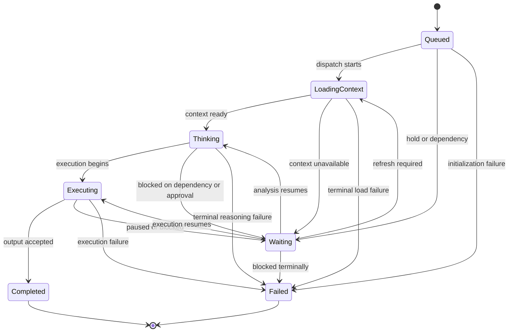

# Execution Progress Model

## Purpose

Define the canonical agent execution progress model used by the runtime to represent live status, timeline events, and operator-facing progress views.

## Scope

This specification defines:

- the allowed agent progress statuses
- lifecycle and transition rules for agent-reported progress
- the execution timeline representation
- the relationship between agent progress, task queue state, and workflow state
- observability requirements for progress reporting

## Design Goals

- provide one simple progress vocabulary across all agents
- make live execution status understandable to operators and downstream systems
- separate agent activity reporting from workflow and queue control state
- preserve auditable event history rather than only current status
- remain model-agnostic and adapter-neutral

## Canonical Agent Progress Statuses

Each active agent invocation must report exactly one current progress status from this set:

- `Queued`
- `Loading Context`
- `Thinking`
- `Executing`
- `Waiting`
- `Completed`
- `Failed`

## Status Definitions

### `Queued`

The agent has been selected for work, but execution has not started.

Common conditions:

- task is enqueued but not yet leased
- workflow state is assigned but not yet activated for the agent
- agent is awaiting scheduler dispatch

### `Loading Context`

The runtime is preparing the agent invocation and loading the required context, memory, policies, and input payloads.

Common conditions:

- context slice is being assembled
- memory slice is being hydrated
- capability bindings are being resolved
- invocation envelope is being prepared

### `Thinking`

The agent is actively analyzing inputs, evaluating options, or preparing a structured response before taking an execution action.

Common conditions:

- reasoning over architecture, scope, or defects
- synthesizing plan or decision output
- evaluating evidence before action generation

### `Executing`

The agent is performing its assigned task and producing its primary work output.

Common conditions:

- generating a plan, report, review, or implementation artifact
- invoking allowed tools or runtime actions
- applying bounded execution steps under the current task contract

### `Waiting`

The agent cannot currently make forward progress because it is waiting on an external condition.

Common conditions:

- waiting for upstream dependency completion
- waiting for human clarification or approval
- waiting for runtime retry window or policy hold
- waiting for another agent's artifact or gate result

### `Completed`

The agent completed its assigned invocation successfully and its outputs were accepted by the runtime.

This is a terminal status for the invocation.

### `Failed`

The agent invocation ended unsuccessfully and did not produce an accepted completion for the current attempt.

Common conditions:

- output validation failure
- runtime or tool failure
- timeout exhaustion
- unrecoverable contract violation

This is terminal for the current invocation attempt. A new attempt may later be created by retry or recovery policy.

## Lifecycle Rules

### Allowed Status Transitions

| From | To | Trigger |
|---|---|---|
| `Queued` | `Loading Context` | invocation preparation starts |
| `Queued` | `Waiting` | dispatch is paused by dependency or hold |
| `Queued` | `Failed` | invocation cannot be initialized |
| `Loading Context` | `Thinking` | context and memory loaded successfully |
| `Loading Context` | `Waiting` | required context source is temporarily unavailable |
| `Loading Context` | `Failed` | context load or invocation assembly fails terminally |
| `Thinking` | `Executing` | action generation or task execution begins |
| `Thinking` | `Waiting` | clarification, dependency, or external result required |
| `Thinking` | `Failed` | reasoning or contract validation fails terminally |
| `Executing` | `Completed` | output accepted and persisted |
| `Executing` | `Waiting` | execution paused for dependency, approval, or retry window |
| `Executing` | `Failed` | execution fails and current attempt ends |
| `Waiting` | `Loading Context` | agent is reactivated and context must be refreshed |
| `Waiting` | `Thinking` | required dependency resolves and analysis resumes |
| `Waiting` | `Executing` | execution can resume directly with valid context |
| `Waiting` | `Failed` | wait condition resolves to terminal failure |

### Forbidden Transitions

- `Completed` does not transition to any other status within the same invocation
- `Failed` does not transition directly back to active execution within the same invocation
- `Queued` does not move directly to `Completed`
- `Loading Context` does not move directly to `Completed`

## Progress State Diagram

## Execution Timeline Model

### Timeline Principles

- The timeline is event-based, not only status-based.
- Each status change must be recorded as a timestamped progress event.
- Timeline events must preserve ordering, actor identity, and causal reason.
- The current visible status is a projection derived from the latest accepted timeline event.

### Progress Event Schema

Each progress event must include:

- `event_id`
- `run_id`
- `workflow_id`
- `workflow_version`
- `task_id`
- `invocation_id`
- `agent_id`
- `previous_status`
- `current_status`
- `timestamp`
- `reason_code`
- `summary`
- `details_ref`

### Canonical Reason Codes

- `enqueued`
- `leased`
- `context_hydration_started`
- `context_hydration_completed`
- `analysis_started`
- `execution_started`
- `dependency_wait`
- `approval_wait`
- `retry_wait`
- `output_accepted`
- `validation_failed`
- `timeout`
- `tool_failure`
- `policy_block`
- `terminal_failure`

### Timeline Views

The runtime publishes three timeline projections:

1. agent activity timeline
2. task progress timeline
3. workflow execution timeline

### Timeline Representation

The agent activity timeline should be rendered as an ordered sequence of status segments.

Example model:

| Sequence | Timestamp | Agent | Task | Status | Reason | Notes |
|---|---|---|---|---|---|---|
| 1 | 2026-08-05T09:00:00Z | planner | task-001 | `Queued` | `enqueued` | waiting for dispatch |
| 2 | 2026-08-05T09:00:03Z | planner | task-001 | `Loading Context` | `context_hydration_started` | context slice assembly |
| 3 | 2026-08-05T09:00:07Z | planner | task-001 | `Thinking` | `analysis_started` | decomposing request |
| 4 | 2026-08-05T09:00:20Z | planner | task-001 | `Executing` | `execution_started` | producing task plan |
| 5 | 2026-08-05T09:00:33Z | planner | task-001 | `Waiting` | `dependency_wait` | awaiting product clarification |
| 6 | 2026-08-05T09:04:10Z | planner | task-001 | `Thinking` | `analysis_started` | clarification received |
| 7 | 2026-08-05T09:04:25Z | planner | task-001 | `Executing` | `execution_started` | finalizing output |
| 8 | 2026-08-05T09:04:40Z | planner | task-001 | `Completed` | `output_accepted` | plan accepted |

## Relationship to Task Queue State

Agent progress status is not the same as task queue status.

Mapping rules:

| Task Queue State | Typical Agent Progress Projection |
|---|---|
| `Waiting` | `Queued` or `Waiting` |
| `Ready` | `Queued` |
| `Executing` | `Loading Context`, `Thinking`, `Executing`, or `Waiting` |
| `Blocked` | `Waiting` |
| `Completed` | `Completed` |
| `Failed` | `Failed` |
| `Cancelled` | no active agent progress status; invocation closes outside this model |
| `Retrying` | `Waiting` |

Interpretation rule:

- queue state describes scheduler and control-plane disposition
- agent progress describes what the selected agent is currently doing within an invocation

## Relationship to Workflow State

- one workflow state may contain multiple progress events for a single agent
- one workflow state may contain progress events from multiple agents when review, gate, or escalation participation is required
- workflow completion must not be inferred solely from `Completed` agent status; it also requires acceptance of outputs and transition validation

## Observability Requirements

### Logging

- emit one structured log record for every accepted progress event
- include `run_id`, `task_id`, `invocation_id`, and `agent_id` in each record
- preserve both previous and current status values for transition analysis

### Metrics

- time spent in each progress status by agent and workflow
- count of transitions into `Waiting`
- count of transitions into `Failed`
- mean context-loading duration
- mean thinking duration
- mean active execution duration
- completion rate by agent and workflow

## Extensibility Rules

- external adapters may enrich progress metadata but may not redefine canonical statuses
- custom UI layers may group statuses visually but must preserve the canonical timeline underneath
- future status additions require runtime versioning and migration guidance because status values are part of the public execution contract

## Acceptance Criteria

The progress model is complete only when all are true:

- Every agent invocation can be represented using only `Queued`, `Loading Context`, `Thinking`, `Executing`, `Waiting`, `Completed`, and `Failed`.
- Status transitions are explicit and auditable.
- The execution timeline preserves ordered status changes with timestamps and reasons.
- Operators can distinguish task queue control state from agent activity state.
- The model remains independent from any specific AI model or provider implementation.