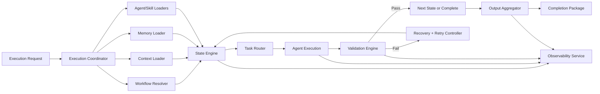

# AI Workflow Runtime Specification

## Purpose

Define the runtime architecture responsible for deterministic execution of AI workflows, including loading framework capabilities, selecting workflow state machines, routing tasks to agents, enforcing governance, and producing validated outputs.

The detailed execution-engine design is defined in `execution-engine.md`. This document remains the top-level runtime specification and control-plane summary.

## Scope

The runtime governs execution across:

- agent loading and capability registration
- skill loading and binding
- context and memory hydration
- workflow selection and orchestration
- task routing and handoff
- output collection and completion validation
- reliability, observability, and extension contracts

## Architecture

### Runtime Layers

1. Control Plane
- Accepts execution requests.
- Performs policy checks and workflow selection.
- Creates execution plans and correlation identifiers.

2. Orchestration Plane
- Runs workflow state machines.
- Coordinates transitions, approvals, retries, and rollback decisions.
- Maintains a canonical execution ledger.

3. Capability Plane
- Loads and serves agents, skills, context providers, and memory adapters.
- Resolves dependencies for each state transition.

4. Data Plane
- Stores execution state, artifacts, logs, metrics, and memory updates.
- Supports resumable and auditable runs.

5. Governance Plane
- Enforces runtime policies, quality gates, routing policies, and compliance constraints.
- Validates completion and release-readiness conditions.

### Core Components

- Runtime API Gateway: receives run requests and status queries.
- Execution Coordinator: initializes run context and orchestrator sessions.
- Workflow Resolver: maps intent to workflow definition and initial state.
- Task Router: assigns state tasks to primary and secondary agents.
- Agent Registry Loader: reads agent contracts and capability matrices.
- Skill Registry Loader: resolves skill dependencies and version constraints.
- Context Loader: loads product, technical, and release context snapshots.
- Memory Loader: hydrates memory categories and recency windows.
- State Engine: executes state transitions as deterministic state machines.
- Validation Engine: evaluates exit criteria, quality gates, and completion checks.
- Output Aggregator: collects artifacts and constructs final run package.
- Observability Service: emits logs, traces, metrics, and audit records.

### High-Level Runtime Flow

## Execution Lifecycle

### Phase 1: Intake and Initialization

- Validate request schema, intent, and required identifiers.
- Issue `run_id`, `correlation_id`, and `workflow_version` lock.
- Load applicable runtime policies and routing configuration.

### Phase 2: Capability and Context Hydration

- Load workflow graph and state contracts.
- Load agents, skills, context snapshot, and memory snapshot.
- Perform compatibility checks and dependency validation.

### Phase 3: Orchestrated State Execution

- Enter workflow start state.
- Route and execute task for active state owner.
- Validate state outputs, then transition, retry, or rollback.

### Phase 4: Completion and Packaging

- Verify terminal state and all mandatory gates.
- Aggregate outputs, evidence, and decision rationale.
- Persist completion package and emit final status.

### Phase 5: Post-Run Persistence

- Store durable memory updates.
- Publish metrics and audit summary.
- Mark run immutable except for governance-approved corrections.

## Task Routing

### Routing Model

- Primary routing is intent-driven and mapped to a workflow start owner.
- Stage routing follows each workflow state's `Owner Agent` contract.
- Secondary participants are attached only for approvals, review, or escalations.

### Routing Inputs

- task intent and requested command
- current workflow state
- agent capability matrix
- escalation rules and quality gate requirements
- runtime constraints (timeouts, retries, policy restrictions)

### Routing Outputs

- assigned agent identifier
- execution contract (input bundle, expected output schema)
- escalation fallback chain
- timeout and retry profile for the task

## Context Loading

### Context Sources

- `.claude/context/product.md`
- `.claude/context/technical.md`
- `.claude/context/release.md`
- `.claude/context/context-map.md`

### Context Strategy

- Load immutable snapshot per run for determinism.
- Normalize documents into typed sections (constraints, goals, risks, interfaces).
- Compute context digest and attach it to the run ledger.
- Support state-local context narrowing to reduce irrelevant payload.

### Validation

- Required context artifacts must exist and pass schema checks.
- Missing required context fails the run before state execution.

## Memory Loading

### Memory Categories

- architectural decisions
- business rules
- coding standards
- known issues
- glossary and technology stack

### Loading Policy

- Hydrate memory by category and recency policy.
- Separate read-only historical memory from writable run memory.
- Apply governance filters for sensitive or restricted entries.

### Writeback Policy

- Persist only durable, non-ephemeral knowledge.
- Require ownership and rationale metadata for new entries.
- Use idempotent memory upsert keyed by semantic fingerprint.

## Workflow Execution

### Execution Model

- Deterministic state machine execution with explicit transitions.
- State contract includes inputs, outputs, entry/exit criteria, rollback, and retry.
- One active state at a time per run; transitions are atomic and ledgered.

### Transition Rules

- `pass`: exit criteria satisfied; move to next state.
- `retry`: transient or fixable failure; re-enter same state under policy.
- `rollback`: structural or validity failure; return to designated prior state.
- `abort`: unrecoverable policy, dependency, or governance breach.

### Gate Handling

- Gate checks occur at configured control states.
- Gate decisions are persisted with approver identity and rationale.
- Gate failure invokes recovery policy and escalation chain.
- The decider is a human by default. Under `config/gate-policy.json`'s
  `auto-on-clean-evidence` mode (see `gate-policy.md`), the runtime itself may approve a
  decision-eligible gate when every policy condition holds — clean upstream validation,
  severity below the configured threshold, no blocking open question, no escalated
  deviation, no unresolved defect on QA-owned gates, an approved precedent for the
  workflow/agent version, and the gate not pinned `human-required`. The decision is
  recorded through the same path as a human one, attributed `runtime:auto-policy` with
  the evaluated evidence, and any condition failing keeps that gate on the human path.
  The Producer Exclusion Rule binds the automated decider role exactly as it binds a
  human one.

## Agent Execution

### Agent Execution Contract

- Input: state payload, context slice, memory slice, constraints, expected schema.
- Output: structured artifact, evidence references, status, and confidence metadata.
- Side effects: must be declared; undeclared side effects are rejected.

### Isolation and Determinism

- Agent execution runs in bounded context with policy-constrained tools.
- Each invocation uses explicit timeout and resource caps.
- Non-deterministic dependencies must be recorded in evidence metadata.

### Capability Resolution

- Runtime resolves agent role from state owner.
- Skills are bound by capability matrix and version compatibility.
- Missing required capabilities trigger escalation or fail-fast behavior.

## Failure Recovery

### Failure Classes

- Input and schema failures
- Missing capability or dependency failures
- Policy and governance failures
- Transient execution failures
- Persistent quality gate failures

### Recovery Actions

- Retry for transient faults within policy limits.
- Rollback for invalid state outputs or structural mismatches.
- Escalate for ambiguity, unresolved risk, or repeated gate failures.
- Abort for unrecoverable compliance or integrity violations.

### Recovery Ledger Requirements

Each recovery event must record:

- failure class and detection point
- chosen recovery action and reason
- retry attempt count and next timeout
- impacted state and artifact references

## Retry Policy

### Default Policy

- Max attempts per state: 3
- Backoff: exponential (`base=2s`, multiplier `x2`, jitter `+-20%`)
- Per-attempt timeout grows linearly by policy profile
- Circuit breaker opens after repeated systemic failures

### Retry Eligibility

Eligible:

- temporary tool failure
- intermittent network/service dependencies
- race conditions in external checks

Not eligible:

- schema violations in required outputs
- policy or compliance violations
- missing mandatory context artifacts

### Escalation Thresholds

- Attempt 2 failure: notify state owner and orchestrator.
- Attempt 3 failure: escalate to tech lead role and trigger rollback or abort decision.

## Output Aggregation

### Aggregation Model

- Collect per-state artifacts with schema-normalized envelopes.
- Preserve provenance: source agent, state, timestamp, and dependency references.
- Build final completion package with:
  - execution summary
  - state-by-state outcomes
  - gate decisions
  - risks and unresolved items
  - traceable artifact index

### Completion Validation

A run is complete only when all are true:

- terminal workflow state reached
- all required gates approved
- required output schemas satisfied
- audit trail and evidence index persisted
- policy-required memory updates committed

## Logging

### Logging Principles

- Structured, machine-parseable logs only.
- Correlate all records with `run_id`, `state_id`, `agent_id`, and `correlation_id`.
- Redact or tokenize secrets and sensitive payloads.

### Log Types

- lifecycle logs (run start, phase changes, completion)
- routing logs (assignment, escalation)
- execution logs (state entry/exit, retries, rollbacks)
- validation logs (gate checks, schema checks)
- audit logs (policy decisions, approvals)

### Retention and Access

- Immutable append-only audit stream.
- Configurable retention by environment and policy tier.
- Role-based access to sensitive operational logs.

## Metrics

### Core Runtime Metrics

- run success rate
- mean time to completion (MTTC)
- state transition latency (p50/p95/p99)
- retry rate and rollback rate
- gate failure rate by workflow and state
- agent assignment utilization
- output validation failure rate

### Reliability and Governance Metrics

- recovery success ratio
- aborted run ratio by failure class
- policy violation count
- memory writeback acceptance/rejection ratio

### Observability Semantics

- Metrics are emitted per run, per state, and per workflow version.
- Dashboards must support trend and regression detection across releases.

## Future Extension Points

### Pluggable Adapters

- memory backend adapters (file, vector store, graph store)
- context provider adapters (repo scan, docs index, external systems)
- output sink adapters (artifact stores, ticketing systems, release systems)

### Execution Extensions

- parallel sub-state execution for independent branches
- speculative execution with deterministic merge rules
- human-in-the-loop intervention states

### Intelligence Extensions

- adaptive routing based on historical performance
- policy-driven dynamic retry tuning
- confidence-based validation thresholds

### Governance Extensions

- policy version negotiation per workflow
- signed gate approvals and tamper-evident audit chains
- compliance profile packs by regulatory domain

## Non-Functional Requirements

- Determinism: identical inputs and policies yield equivalent transitions.
- Reliability: recovery behavior is explicit and bounded.
- Traceability: every decision is attributable and auditable.
- Extensibility: adapters and policies evolve without workflow rewrites.
- Safety: policy and security constraints are enforced by default.
