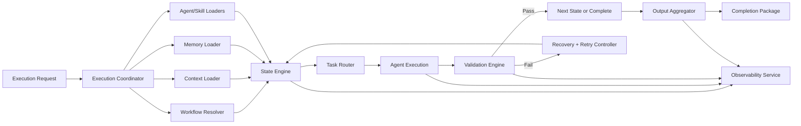

# AI Workflow Runtime Specification

## Purpose

Define the runtime architecture responsible for deterministic execution of AI workflows, including loading framework capabilities, selecting workflow state machines, routing tasks to agents, enforcing governance, and producing validated outputs.

The detailed execution-engine design is defined in `execution-engine.md`. This document remains the top-level runtime specification and control-plane summary.

## Scope

The runtime governs execution across:

- agent loading and capability registration
- skill loading and binding
- context and memory hydration
- workflow selection and orchestration
- task routing and handoff
- output collection and completion validation
- reliability, observability, and extension contracts

## Architecture

### Runtime Layers

1. Control Plane
- Accepts execution requests.
- Performs policy checks and workflow selection.
- Creates execution plans and correlation identifiers.

2. Orchestration Plane
- Runs workflow state machines.
- Coordinates transitions, approvals, retries, and rollback decisions.
- Maintains a canonical execution ledger.

3. Capability Plane
- Loads and serves agents, skills, context providers, and memory adapters.
- Resolves dependencies for each state transition.

4. Data Plane
- Stores execution state, artifacts, logs, metrics, and memory updates.
- Supports resumable and auditable runs.

5. Governance Plane
- Enforces runtime policies, quality gates, routing policies, and compliance constraints.
- Validates completion and release-readiness conditions.

### Core Components

- Runtime API Gateway: receives run requests and status queries.
- Execution Coordinator: initializes run context and orchestrator sessions.
- Workflow Resolver: maps intent to workflow definition and initial state.
- Task Router: assigns state tasks to primary and secondary agents.
- Agent Registry Loader: reads agent contracts and capability matrices.
- Skill Registry Loader: resolves skill dependencies and version constraints.
- Context Loader: loads product, technical, and release context snapshots.
- Memory Loader: hydrates memory categories and recency windows.
- State Engine: executes state transitions as deterministic state machines.
- Validation Engine: evaluates exit criteria, quality gates, and completion checks.
- Output Aggregator: collects artifacts and constructs final run package.
- Observability Service: emits logs, traces, metrics, and audit records.

### High-Level Runtime Flow

## Execution Lifecycle

### Phase 1: Intake and Initialization

- Validate request schema, intent, and required identifiers.
- Issue `run_id`, `correlation_id`, and `workflow_version` lock.
- Load applicable runtime policies and routing configuration.

### Phase 2: Capability and Context Hydration

- Load workflow graph and state contracts.
- Load agents, skills, context snapshot, and memory snapshot.
- Perform compatibility checks and dependency validation.

### Phase 3: Orchestrated State Execution

- Enter workflow start state.
- Route and execute task for active state owner.
- Validate state outputs, then transition, retry, or rollback.

### Phase 4: Completion and Packaging

- Verify terminal state and all mandatory gates.
- Aggregate outputs, evidence, and decision rationale.
- Persist completion package and emit final status.

### Phase 5: Post-Run Persistence

- Store durable memory updates.
- Publish metrics and audit summary.
- Mark run immutable except for governance-approved corrections.

## Task Routing

### Routing Model

- Primary routing is intent-driven and mapped to a workflow start owner.
- Stage routing follows each workflow state's `Owner Agent` contract.
- Secondary participants are attached only for approvals, review, or escalations.

### Routing Inputs

- task intent and requested command
- current workflow state
- agent capability matrix
- escalation rules and quality gate requirements
- runtime constraints (timeouts, retries, policy restrictions)

### Routing Outputs

- assigned agent identifier
- execution contract (input bundle, expected output schema)
- escalation fallback chain
- timeout and retry profile for the task

## Context Loading

### Context Sources

- `.claude/context/product.md`
- `.claude/context/technical.md`
- `.claude/context/release.md`
- `.claude/context/context-map.md`

### Context Strategy

- Load immutable snapshot per run for determinism.
- Normalize documents into typed sections (constraints, goals, risks, interfaces).
- Compute context digest and attach it to the run ledger.
- Support state-local context narrowing to reduce irrelevant payload.
- Mark every frozen slice member with a read hint, so the slice stays the provenance record
  it always was while the agent reads only what its phase needs:
  - `required`: read before the work starts (templates the phase renders, the skills its
    dispatch marks required, the product, technical, and release context, and the gate matrix
    for a phase whose artifact names its gate owner);
  - `on-demand`: consult when the stated decision needs it (the routed workflow
    specification, the domain model, the runtime's own implemented-surface record);
  - `runtime-resolved`: resolved by the runtime on the agent's behalf and not the agent's to
    read (the registries, the capability matrix, the skill matrix). The planning phase is the
    one exception: its artifact cites capability identifiers and skill codes and is validated
    against them, so the capability matrix and the skill registry are `required` there.
- A member the base slice and the phase slice both name is frozen once; a file is never
  listed twice.

### Validation

- Required context artifacts must exist and pass schema checks.
- Missing required context fails the run before state execution.

## Task Context

The task context is the lightweight, runtime-owned shared execution state of one run:
`runs/<run-id>/task-context.yaml`, schema `framework.runtime/task-context.v1`. It exists so
that a downstream agent starts from facts the run has already established instead of
re-deriving them from every upstream artifact in full.

### Content

Only what downstream phases consume, as one-line facts keyed by the identifier the source
artifact gave them: `task_id`, `objective`, `inputs`, `scope` (in and out), `affected_areas`,
`changed_files`, `repository_context` (relevant modules and files, and the conditions under
which a repository rescan is warranted), `relevant_agents`, `relevant_skills` (the skill
dispatch verdict per phase), `completed_phases` (artifact, digest, validation result,
attempts), `gates`, `decisions`, `constraints`, `validation_requirements` (acceptance
criteria, test focus, executed evidence), `risks`, `open_questions`, `findings`, `verdicts`,
`plan_tasks`, `artifacts`, and `parallel_groups`.

### Rules

- Derived, never authored. The runtime rebuilds it from the state store, the gate records, and
  the accepted artifacts at every dispatch, completion, gate decision, and rollback; it is
  written only when its content changed, so a replayed command leaves it byte-identical.
- Extraction is deterministic table and bullet parsing. No summarisation, no narrative. Each
  cell is capped and each register is capped; what exceeds a cap is cited by identifier and
  the reader opens the source section.
- Nothing enters from an artifact the Validation Engine has not accepted. A rejected or
  superseded attempt contributes nothing.
- Every text in it is data to the agent, exactly as a supplied input is.
- The dispatch prompt names it as the first thing to read after the envelope, and names the
  sections of each upstream artifact to read first and the sections to open only on demand.
  An artifact type with no section map is read in full.

## Progressive Module Loading

An agent's module set is loaded in two tiers derived from the `role` each module declares in
its manifest. The manifest's `loadOrder` stays the single authority; no module is renamed,
moved, or made optional.

| Tier | Roles | When read |
|---|---|---|
| core | `operating-charter`, `reasoning-procedure`, `output-contract`, `quality-contract` | in full, in load order, on every attempt, before any work |
| on-demand | `agent-contract`, `execution-lifecycle`, `reference-examples` | the moment the stated trigger applies; binding from that moment exactly as a core module is |

Triggers, as the envelope states them under `capability_bindings.load_profile.on_demand[]`:

- `agent-contract` (`identity.md`): before deciding an error class, a refusal, a decision
  right, or an escalation; whenever the reasoning procedure or the quality contract refers to
  it; whenever a supplied input asks for something the charter's boundary table does not
  settle.
- `execution-lifecycle` (`execution.md`): when the run leaves the direct Execution to
  Completion path (Waiting, Delegation, Retry, Failure), when a stage's exit condition is
  unclear, and before any handoff or gate question the charter does not settle.
- `reference-examples` (`examples.md`): only when the output shape is still ambiguous after
  the output contract has been read, or on a repair pass for a failed structural check.

Why this is safe: every charter (`system.md`) carries the role, the invariants, the boundary
enforcement table, and the module precedence order, so the happy path is fully governed by
the core tier; the on-demand modules restate and elaborate what the core already binds, and
their triggers are exactly the moments at which the elaboration is needed. Trade-off, stated:
an agent that mis-recognises a trigger reads `identity.md` late rather than never; the
Validation Engine and the gate still judge the artifact by the same contracts.

The runtime performs the Initialization checks the lifecycle modules ask of their agents
(manifest identity, version, status, load order, and the twelve contract sections of
`identity.md`) once at dispatch and records them under
`capability_bindings.contract_checks`. An agent accepts a `pass` record and repeats the checks
only when the record is not `pass` or when no envelope governs the invocation.

A manifest may pin a module to the core tier under `runtime.loadProfile.core`. The operator may
force the pre-0.7.0 behaviour for one dispatch with `dispatch --load-profile full`. A repair
pass loads `quality.md` and `output.md` first and then only the module a failed check's quality
reference names.

## Conditional Skill Dispatch

Skill *resolution* is unchanged: every phase-mandatory code and every manifest-declared code
must resolve through `registry/skills.yaml`, and guard `G1-CAPABILITY` blocks a phase whose
skills do not. What is conditional is *reading*. The envelope's `skill_dispatch[]` gives each
code a status and its basis:

| Status | Meaning |
|---|---|
| `required` | read before the work starts |
| `not-triggered` | resolved and available; read only if the work reveals the domain, in which case the artifact records the domain as affected |

Domain-general codes (S01, S02, S03, S07, S10, S11, S12) are always `required` when a phase
or manifest names them. Domain-conditional codes (S04 Avalonia, S05 React, S06 Database, S08
Performance, S09 Security) are `required` when their area is affected and `not-triggered`
otherwise. An area is affected when the task context's `affected_areas` derivation finds a
domain trigger in a supplied input or an accepted upstream artifact, or when the operator
declares it (`--affected-area <area>`, additive, persisted on the run). The trigger table is
`DOMAIN_SKILLS` in `runtime/task_context.py` and is described in `skills/skill-resolver.md`.

Two safety rules: when no text is available to derive affectedness, every conditional code is
`required`; and S09 Security is always `required` in review and validation phases, because a
reviewer is the last line of defence and "the task did not mention security" is not evidence
that nothing security-relevant changed.

## Execution Metrics

Every run records `runs/<run-id>/execution-metrics.json`, schema
`framework.runtime/execution-metrics.v1`, rebuilt at every completion and aggregation and on
demand by `framework_runtime.py metrics --run-id <id>`; the final report carries its summary.
It is derived from persisted evidence only: wall-clock and agent-active duration, phases
executed, agent invocations (total and distinct), skill reads required and not triggered,
context members required and declared, files read by more than one dispatch, validation runs,
gate decisions, parallel groups, and a byte-based context estimate per dispatch under both the
legacy rules (every module, every member, every upstream artifact in full) and the progressive
rules. The estimate is four bytes per token and is labelled an estimate; its purpose is to make
a regression visible, not to bill.

## Model Tiers

A phase declares the class of model that should execute it. The runtime never calls a model;
it names a tier and a host hint in the invocation envelope, and the dispatching session passes
the hint to the host as the per-dispatch model override. Entrypoint declarations stay
`model: inherit`, and no tier appears in agent module text or in a Phase Model table.

**Declaration.** `config/model-tier-policy.json` is the one carrier. `phases` maps each workflow
identifier to `{phase: tier}`, where the tier is `light` (read-and-summarise and template-fill
work), `standard` (bounded-judgement analysis and validation), or `deep` (structural design,
root cause, implementation, review judgement). `hints` maps each of the three tiers to one
opaque host alias string, which the runtime copies verbatim and never branches on; the reserved
value `inherit` means pass no override. The file is shipped in the managed `config/` directory,
and `verify_registry_coverage.py` check `C7` fails on a phase with no declared tier, on an
entry naming a phase that does not exist, and when fewer than 3 of the 6 implement-feature
phases are non-deep. An absent file resolves every phase to `standard` with `inherit` and never
promotes one, because with no file there is no hint for a higher tier. With the file present, a
phase with no entry resolves to `standard`, and it inherits the host model only because the
`standard` hint is reserved as `inherit`: the loader and `C7` reject any other value for it. A
file that exists but is unreadable, names an unknown tier, or lacks a hint fails
the dispatch as a `policy-failure`. There is no per-dispatch switch to disable or override a
tier: removing the file is the only off position.

**Envelope field.** Every invocation envelope carries `model_tier`:
`{tier, host_hint, basis, escalation}`. `basis` states why the tier was chosen, and
`escalation` is empty unless the phase was promoted, in which case it carries `from`, `to`,
the two rejection counts, and `reason`. The `invocation_started` event carries `model_tier` and
`escalated` in its detail, and the dispatch prompt and console output state the tier and hint.
The field is additive and deterministic from run state; it does not enter the payload digest.

**Escalation.** A rejected cheaper attempt is never retried at the same tier. At dispatch the
runtime counts two recorded rejections of the phase: validator rejections, which are recovery
ledger entries under the phase's own state id with reason code `validation_failed`, and gate
rejections that were rolled back, which are entries in the work item's `supersessions`. The
phase resolves one tier higher per recorded rejection, capped at `deep`, and a tier is never
lowered. A transport failure, which produced nothing to judge, and a gate rejection with no
rollback do not count. Because both counts are read from persisted state, a dispatch built in a
fresh session resolves exactly as one built in the same session. `C8` checks monotonicity.

**Metrics.** `execution-metrics.json` carries `model_tiers`: invocations and estimated context
bytes for `light`, `standard`, `deep`, and `untiered` (records that predate the field), whose
values sum to the run totals, plus `non_deep_share` of tiered invocations. Each `per_phase` row
carries its `model_tier`. A tier is advice only: no gate, validator, or acceptance rule changes
with it, and the figures count what was advised, not what the host ran.

## Memory Loading

### Memory Categories

- architectural decisions
- business rules
- coding standards
- known issues
- glossary and technology stack

### Loading Policy

- Hydrate memory by category and recency policy.
- Separate read-only historical memory from writable run memory.
- Apply governance filters for sensitive or restricted entries.

### Writeback Policy

- Persist only durable, non-ephemeral knowledge.
- Require ownership and rationale metadata for new entries.
- Use idempotent memory upsert keyed by semantic fingerprint.

## Workflow Execution

### Execution Model

- Deterministic state machine execution with explicit transitions.
- State contract includes inputs, outputs, entry/exit criteria, rollback, and retry.
- One active state at a time per run; transitions are atomic and ledgered.

### Transition Rules

- `pass`: exit criteria satisfied; move to next state.
- `retry`: transient or fixable failure; re-enter same state under policy.
- `rollback`: structural or validity failure; return to designated prior state. For a gate
  rejection the designated prior state is the phase the authoriser names (the gated phase or
  a completed hard predecessor of it), and the return is a supersession of that phase's
  completed downstream cone -- every completed phase that transitively hard-depends on it,
  the gated phase included: each re-enters as a new attempt under the same idempotency key,
  its committed evidence preserved immutably, and the gate is re-armed for a fresh human
  decision. The authorisation is refused while an approved gate stands over any phase in
  that range, because a completed gate cannot be re-armed.
- `abort`: unrecoverable policy, dependency, or governance breach.

### Gate Handling

- Gate checks occur at configured control states.
- Gate decisions are persisted with approver identity and rationale.
- Gate failure invokes recovery policy and escalation chain.
- The decider is a human by default. Under `config/gate-policy.json`'s
  `auto-on-clean-evidence` mode (see `gate-policy.md`), the runtime itself may approve a
  decision-eligible gate when every policy condition holds — clean upstream validation,
  severity below the configured threshold, no blocking open question, no escalated
  deviation, no unresolved defect on QA-owned gates, an approved precedent for the
  workflow/agent version, and the gate not pinned `human-required`. The decision is
  recorded through the same path as a human one, attributed `runtime:auto-policy` with
  the evaluated evidence, and any condition failing keeps that gate on the human path.
  The Producer Exclusion Rule binds the automated decider role exactly as it binds a
  human one.

## Agent Execution

### Agent Execution Contract

- Input: state payload, context slice, memory slice, constraints, expected schema.
- Output: structured artifact, evidence references, status, and confidence metadata.
- Side effects: must be declared; undeclared side effects are rejected.

### Isolation and Determinism

- Agent execution runs in bounded context with policy-constrained tools.
- Each invocation uses explicit timeout and resource caps.
- Non-deterministic dependencies must be recorded in evidence metadata.

### Capability Resolution

- Runtime resolves agent role from state owner.
- Skills are bound by capability matrix and version compatibility.
- Missing required capabilities trigger escalation or fail-fast behavior.

## Failure Recovery

### Failure Classes

- Input and schema failures
- Missing capability or dependency failures
- Policy and governance failures
- Transient execution failures
- Persistent quality gate failures

### Recovery Actions

- Retry for transient faults within policy limits.
- Rollback for invalid state outputs or structural mismatches. A rollback past a rejected
  gate is authorised by a listed non-producing owner of that gate, never inferred from the
  rejection alone, and is refused once the target phase has spent its charged attempts.
- Escalate for ambiguity, unresolved risk, or repeated gate failures.
- Abort for unrecoverable compliance or integrity violations.

### Recovery Ledger Requirements

Each recovery event must record:

- failure class and detection point
- chosen recovery action and reason
- retry attempt count and next timeout
- impacted state and artifact references

## Retry Policy

### Default Policy

- Max attempts per state: 3
- Backoff: exponential (`base=2s`, multiplier `x2`, jitter `+-20%`)
- Per-attempt timeout grows linearly by policy profile
- Circuit breaker opens after repeated systemic failures

### Retry Eligibility

Eligible:

- temporary tool failure
- intermittent network/service dependencies
- race conditions in external checks

Not eligible:

- schema violations in required outputs
- policy or compliance violations
- missing mandatory context artifacts

### Escalation Thresholds

- Attempt 2 failure: notify state owner and orchestrator.
- Attempt 3 failure: escalate to tech lead role and trigger rollback or abort decision.

## Output Aggregation

### Aggregation Model

- Collect per-state artifacts with schema-normalized envelopes.
- Preserve provenance: source agent, state, timestamp, and dependency references.
- Build final completion package with:
  - execution summary
  - state-by-state outcomes
  - gate decisions
  - risks and unresolved items
  - traceable artifact index

### Completion Validation

A run is complete only when all are true:

- terminal workflow state reached
- all required gates approved
- required output schemas satisfied
- audit trail and evidence index persisted
- policy-required memory updates committed

## Logging

### Logging Principles

- Structured, machine-parseable logs only.
- Correlate all records with `run_id`, `state_id`, `agent_id`, and `correlation_id`.
- Redact or tokenize secrets and sensitive payloads.

### Log Types

- lifecycle logs (run start, phase changes, completion)
- routing logs (assignment, escalation)
- execution logs (state entry/exit, retries, rollbacks)
- validation logs (gate checks, schema checks)
- audit logs (policy decisions, approvals)

### Retention and Access

- Immutable append-only audit stream.
- Configurable retention by environment and policy tier.
- Role-based access to sensitive operational logs.

## Metrics

### Core Runtime Metrics

- run success rate
- mean time to completion (MTTC)
- state transition latency (p50/p95/p99)
- retry rate and rollback rate
- gate failure rate by workflow and state
- agent assignment utilization
- output validation failure rate

### Reliability and Governance Metrics

- recovery success ratio
- aborted run ratio by failure class
- policy violation count
- memory writeback acceptance/rejection ratio

### Observability Semantics

- Metrics are emitted per run, per state, and per workflow version.
- Dashboards must support trend and regression detection across releases.

## Future Extension Points

### Pluggable Adapters

- memory backend adapters (file, vector store, graph store)
- context provider adapters (repo scan, docs index, external systems)
- output sink adapters (artifact stores, ticketing systems, release systems)

### Execution Extensions

- parallel sub-state execution for independent branches
- speculative execution with deterministic merge rules
- human-in-the-loop intervention states

### Intelligence Extensions

- adaptive routing based on historical performance
- policy-driven dynamic retry tuning
- confidence-based validation thresholds

### Governance Extensions

- policy version negotiation per workflow
- signed gate approvals and tamper-evident audit chains
- compliance profile packs by regulatory domain

## Non-Functional Requirements

- Determinism: identical inputs and policies yield equivalent transitions.
- Reliability: recovery behavior is explicit and bounded.
- Traceability: every decision is attributable and auditable.
- Extensibility: adapters and policies evolve without workflow rewrites.
- Safety: policy and security constraints are enforced by default.
