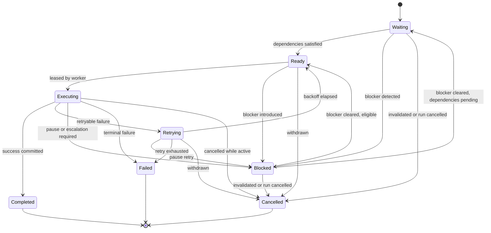
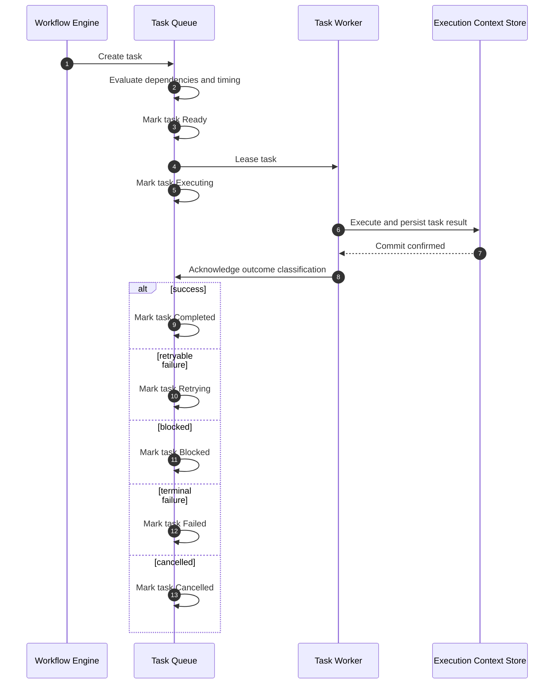
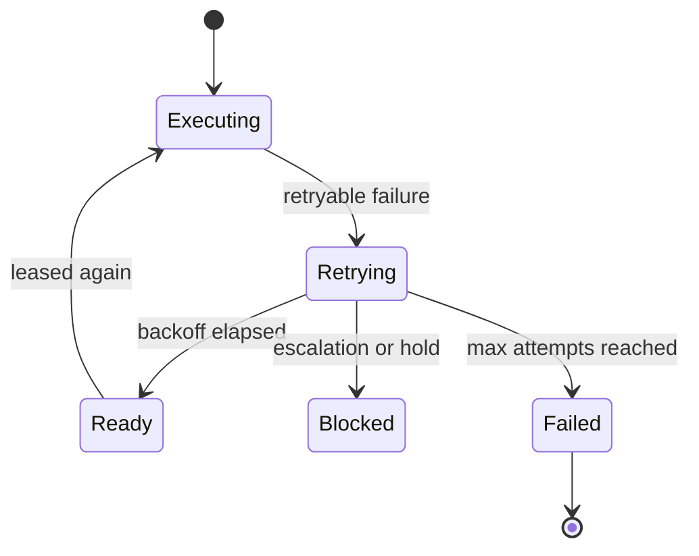

# Task Queue Design

## Purpose

Define the task queue used by the execution engine to schedule, dispatch, track, retry, and recover workflow tasks in a deterministic and extensible way.

## Scope

This specification covers:

- queue responsibilities and boundaries
- task data model
- task lifecycle and transition rules
- dispatch, leasing, and acknowledgement behavior
- blocking, retry, cancellation, and failure handling
- observability and extension points

## Design Goals

- Support workflows composed of many independently schedulable tasks.
- Make task progression explicit and auditable.
- Separate queue state from worker implementation details.
- Preserve idempotency during retries and worker loss.
- Allow multiple queue backends without changing workflow semantics.

## Queue Responsibilities

- store pending task work items for all active workflow runs
- determine when a task is eligible for dispatch
- lease tasks to workers for bounded execution windows
- capture lifecycle transitions as durable queue events
- schedule retries and unblock dependent tasks
- expose task status for operators and higher-level runtime components

## Queue Boundaries

The task queue does not:

- execute workflow business logic
- resolve agent prompts or provider-specific requests
- store full workflow context as the system of record
- decide workflow-level policy outside configured transition rules

The execution context store remains the source of truth for run state. The queue is the source of truth for task scheduling state.

## Task Model

Each workflow state may emit one or more queue tasks. A task represents one schedulable unit of execution.

### Required Task Fields

- `task_id`
- `run_id`
- `workflow_id`
- `workflow_version`
- `state_id`
- `task_type` (`state`, `gate`, `recovery`, `aggregation`, `escalation`)
- `owner_agent_id`
- `status`
- `priority`
- `attempt`
- `max_attempts`
- `idempotency_key`
- `payload_ref`
- `created_at`

### Optional Task Fields

- `available_at`
- `deadline_at`
- `lease_expires_at`
- `blocked_reason`
- `depends_on_task_ids`
- `failure_class`
- `failure_detail`
- `cancel_reason`
- `last_worker_id`

## Task States

Every task must be in exactly one of these states:

- `Waiting`
- `Ready`
- `Executing`
- `Blocked`
- `Completed`
- `Failed`
- `Cancelled`
- `Retrying`

### State Definitions

#### `Waiting`

The task has been created but is not yet eligible for dispatch.

Common causes:

- upstream dependencies not yet satisfied
- release time or `available_at` not yet reached
- workflow state emitted the task ahead of activation

#### `Ready`

The task is eligible to be leased and executed immediately.

Entry conditions:

- all hard dependencies completed successfully
- no active block exists
- current time is at or past `available_at`
- workflow run is not paused or cancelled

#### `Executing`

The task has an active lease and is currently owned by one worker.

Execution guarantees:

- only one active lease at a time
- lease timeout must be explicit
- worker progress heartbeats may extend the lease under policy

#### `Blocked`

The task cannot proceed until an external condition is resolved.

Typical blockers:

- missing prerequisite artifact
- unresolved human escalation
- upstream gate rejection awaiting remediation
- temporary policy hold

#### `Completed`

The task finished successfully and its outputs were durably committed.

This is a terminal state.

#### `Failed`

The task cannot be completed automatically within policy.

Typical causes:

- non-retryable validation failure
- retry budget exhausted
- unrecoverable infrastructure or contract failure
- explicit terminal failure returned by the worker

This is a terminal state unless a human operator opens a new recovery task.

#### `Cancelled`

The task was intentionally stopped before successful completion.

Typical causes:

- run cancelled by operator
- superseded by rollback or alternate plan
- dependency invalidated

This is a terminal state.

#### `Retrying`

The task failed in a retryable way and is waiting for its next execution attempt.

Retrying differs from `Waiting`:

- `Waiting` means the task has not yet become initially eligible
- `Retrying` means the task has already executed and is under explicit retry policy

## Lifecycle Rules

### Allowed Transitions

| From | To | Trigger |
|---|---|---|
| `Waiting` | `Ready` | dependencies and release conditions satisfied |
| `Waiting` | `Blocked` | blocking condition detected before first execution |
| `Waiting` | `Cancelled` | run cancelled or task invalidated |
| `Ready` | `Executing` | task leased by worker |
| `Ready` | `Blocked` | new blocker introduced before dispatch |
| `Ready` | `Cancelled` | run cancelled or task withdrawn |
| `Executing` | `Completed` | worker result accepted and outputs committed |
| `Executing` | `Blocked` | external dependency or escalation pause required |
| `Executing` | `Retrying` | retryable failure classified |
| `Executing` | `Failed` | terminal failure classified |
| `Executing` | `Cancelled` | operator or runtime cancels active task |
| `Blocked` | `Waiting` | blocker cleared but dependencies still not fully satisfied |
| `Blocked` | `Ready` | blocker cleared and dispatch conditions satisfied |
| `Blocked` | `Cancelled` | run cancelled or task invalidated |
| `Retrying` | `Ready` | backoff elapsed and retry gate opened |
| `Retrying` | `Blocked` | retry paused by escalation or dependency issue |
| `Retrying` | `Failed` | retry budget exhausted or breaker open |
| `Retrying` | `Cancelled` | run cancelled or retry withdrawn |

### Forbidden Transitions

- terminal states do not transition directly to active states
- `Completed` never transitions to `Executing`
- `Failed` never retries in place; a new recovery or replay task must be emitted
- `Cancelled` never resumes in place; a new task must be created

## Lifecycle State Diagram

## Dispatch Lifecycle

### Queue Flow

1. Runtime creates a task in `Waiting` or `Ready`.
2. Queue evaluates dependencies, blockers, and timing constraints.
3. Eligible task enters `Ready`.
4. Dispatcher leases the task and moves it to `Executing`.
5. Worker returns one of: success, retryable failure, block request, terminal failure, or cancellation acknowledgement.
6. Queue commits the next lifecycle state only after the execution ledger is updated.

### Dispatch Sequence

## Dependency Handling

### Dependency Types

- hard dependency: upstream task must be `Completed`
- soft dependency: upstream task output is preferred but not required
- control dependency: upstream gate, approval, or escalation must resolve first

### Dependency Rules

- A task with unmet hard dependencies remains `Waiting`.
- A task with a resolved blocker but unmet hard dependencies returns to `Waiting`, not `Ready`.
- A task enters `Blocked` only when eligibility existed or execution started and a new blocking condition prevents forward motion.

## Lease Model

### Lease Rules

- A task in `Ready` may be leased by only one worker.
- Leasing atomically transitions the task to `Executing`.
- Leases expire automatically unless extended by heartbeat policy.
- Lease expiry does not itself mean `Failed`; it triggers recovery classification.

### Lease Expiry Outcomes

- move to `Retrying` for transient worker loss
- move to `Blocked` when human review is required
- move to `Failed` when policy marks the task unrecoverable

## Retry Design

### Retry Entry Conditions

A task may enter `Retrying` only when all are true:

- the failure is classified as retryable
- `attempt < max_attempts`
- no policy breaker is open
- the run remains active

### Retry Behavior

- increment `attempt`
- compute next `available_at` using the retry profile
- preserve the same `task_id` and `idempotency_key`
- keep prior attempts in the task event history

### Retry State Diagram

## Blocking Design

### Blocking Rules

- `Blocked` is explicit and reasoned; every blocked task must record `blocked_reason`.
- A blocked task must also reference the condition owner, such as upstream task, gate, or human escalation case.
- Clearing a block is a control action that emits a queue event.

### Common Block Reasons

- `awaiting_human_decision`
- `awaiting_dependency_output`
- `awaiting_policy_exception`
- `awaiting_recovery_task`
- `awaiting_external_system`

## Failure and Cancellation Design

### Failure Rules

- `Failed` means no further automatic progress is permitted for the task.
- Failure must record a normalized `failure_class` and `failure_detail`.
- Workflow recovery may emit a replacement task, but the failed task remains immutable.

### Cancellation Rules

- Cancellation is intentional, not accidental.
- An executing task may be cancelled only through a cancellation command recorded in the run ledger.
- Cancellation must preserve partial execution evidence for auditability.

## Task Events

Every lifecycle transition must emit a queue event.

Required event fields:

- `event_id`
- `task_id`
- `run_id`
- `previous_status`
- `new_status`
- `timestamp`
- `actor_type`
- `actor_id`
- `reason_code`
- `metadata`

Canonical event types:

- `task_created`
- `task_ready`
- `task_leased`
- `task_heartbeat`
- `task_blocked`
- `task_unblocked`
- `task_retry_scheduled`
- `task_completed`
- `task_failed`
- `task_cancelled`

## Workflow Integration

### Relationship to Workflow State Execution

- one workflow state may emit one task when execution is strictly sequential
- one workflow state may emit multiple tasks when fan-out is explicitly allowed by workflow definition
- downstream tasks may be created eagerly in `Waiting` or lazily when predecessors complete

### Completion Rules

A workflow step is considered queue-complete only when all emitted tasks for that step are in terminal states and at least one required success path remains valid.

## Extensibility

### Extension Points

- queue backend adapter
- dispatch priority policy
- retry strategy plugin
- blocker classifier
- task event subscribers
- operator status projections

### Compatibility Rules

- Extensions may add metadata fields but may not change canonical task states.
- Extensions may specialize dispatch policy but may not bypass lease semantics.
- Extensions may add new reason codes but must map outcomes to the canonical lifecycle.

## Observability

### Logs

- task creation and enqueue decisions
- status transitions
- lease issue, renewal, and expiry
- retry scheduling and exhaustion
- block and unblock actions
- cancellation commands and acknowledgements

### Metrics

- tasks created per workflow
- ready-to-lease latency
- execution duration by task type
- blocked duration by reason
- retry count by state and agent
- failure rate by failure class
- cancellation rate
- queue depth by lifecycle state

## Acceptance Criteria

The task queue design is complete only when all are true:

- Every task can be represented in one canonical lifecycle state.
- All transitions between `Waiting`, `Ready`, `Executing`, `Blocked`, `Completed`, `Failed`, `Cancelled`, and `Retrying` are explicitly governed.
- Lease loss, retry, blocking, failure, and cancellation are auditable.
- The design supports many-task workflows without coupling queue semantics to a specific AI model or queue backend.