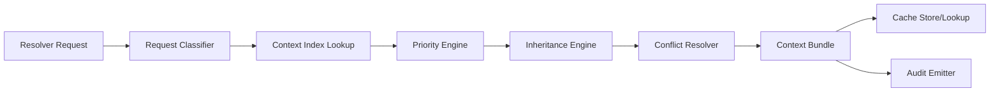

# Context Resolver Specification

## Purpose

Define the runtime component that decides which context artifacts each agent should load for a given workflow state, while minimizing unnecessary context and preserving determinism.

## Objectives

- Load only context required by the current agent task.
- Preserve correctness with explicit precedence and inheritance rules.
- Provide deterministic outcomes for identical inputs.
- Reduce latency and token cost through reusable cache layers.

## Inputs

- workflow identifier and version
- workflow state identifier
- primary agent identifier
- task intent and required output schema
- context map and section-level metadata
- optional escalation flags and risk profile

## Outputs

- resolved context bundle (ordered)
- excluded context list with exclusion reasons
- effective values after inheritance and conflict resolution
- context digest used for traceability and cache keys

## Resolver Architecture

### Components

- Request Classifier: maps task intent and workflow state to context requirements.
- Context Index: section-level metadata catalog for context files.
- Priority Engine: ranks candidate context sections by relevance and criticality.
- Inheritance Engine: applies layered override rules.
- Conflict Resolver: resolves contradictory values using deterministic precedence.
- Context Cache: serves previously resolved bundles when safe.
- Audit Emitter: records what was loaded, excluded, and why.

### High-Level Flow

## Loading Priority

### Base Priority Order

1. state-critical sections from context-map
2. agent-mandatory sections defined by role contract
3. workflow-phase sections (scope, design, implementation, verification, release)
4. domain-support sections relevant to current task intent
5. optional reference sections only when budget allows

### File-Level Default Priority

1. product-context.md
2. technical-context.md
3. release-context.md
4. context-map.md

### Section Scoring

Each candidate section receives a weighted score:

- relevance to agent role and state
- dependency criticality for current output schema
- recency and approval state
- risk impact (security, quality, release)

The resolver loads highest-scoring sections first until all mandatory requirements are satisfied.

## Context Inheritance

### Inheritance Layers

1. Global baseline context
2. Workflow-level context refinements
3. Agent-role context profile
4. Task-instance overrides

### Inheritance Rules

- Child layers may override parent layers only for keys marked overridable.
- Non-overridable keys (policy, compliance, safety constraints) are immutable.
- Missing child values inherit parent values.
- Every override must record source layer and rationale metadata.

### Effective Context Construction

The effective bundle is created by deterministic merge in layer order with explicit key provenance:

- key
- value
- source file
- source layer
- override status

## Conflict Resolution

### Conflict Types

- direct value conflict for same key
- semantic conflict across different keys
- stale-vs-current approval conflict
- policy constraint conflict

### Deterministic Resolution Policy

1. hard policy and compliance constraints win
2. workflow-state-specific constraints win over generic role defaults
3. newer approved context wins over older approved context
4. unresolved semantic conflicts escalate to orchestrator decision

### Resolution Outcomes

- auto-resolved with winning source
- blocked with escalation required
- blocked with validation failure

All outcomes must be logged with conflict class and decision evidence.

## Caching Strategy

### Cache Levels

- L1: in-run memory cache per agent invocation
- L2: per-workflow-version cache for repeated states
- L3: cross-run shared cache keyed by context digest and policy version

### Cache Keys

- workflow version
- state id
- agent id
- intent class
- context artifact versions
- policy version

### Invalidation Rules

Invalidate cache entry when any of the following changes:

- context file content hash
- approval state of any participating section
- workflow version
- agent contract version
- runtime policy version

### Safety Controls

- No cache reuse across incompatible policy versions.
- Sensitive sections can be marked non-cacheable.
- Cache hits must still pass mandatory schema and policy validation.

## Minimizing Unnecessary Context

### Reduction Tactics

- section-level loading instead of whole-file loading
- strict mandatory-vs-optional classification
- relevance threshold to exclude low-signal sections
- progressive loading: start minimal, expand only if validation requires
- per-state context budget caps with explicit expansion triggers

### Expansion Triggers

Expand context only when:

- output schema validation fails due to missing prerequisites
- confidence score falls below threshold
- escalation policy requests broader evidence

## Runtime Integration

- Resolver executes during context hydration in runtime phase 2.
- Resolved bundle is attached to the state execution contract.
- Exclusion list and digest are written to the execution ledger.
- Validation engine can request one controlled re-resolution pass.

## Observability

### Required Logs

- selected sections and priority scores
- excluded sections with reasons
- inheritance overrides applied
- conflict decisions and escalation paths
- cache hit/miss and invalidation cause

### Metrics

- average sections loaded per state
- context load latency
- cache hit ratio by level
- re-resolution rate
- context-related validation failure rate
- token/size reduction vs full-context baseline

## Future Optimization

### Near-Term

- adaptive priority weights from historical success/failure outcomes
- role-specific section embeddings for faster relevance ranking
- predictive prefetch for next likely workflow state

### Mid-Term

- graph-based dependency resolver using context-map relationships
- semantic deduplication across overlapping context sections
- confidence-aware context budget auto-tuning

### Long-Term

- closed-loop resolver learning using completion quality signals
- multi-agent cooperative context sharing with isolation guarantees
- policy-aware compression and canonical context snapshots
