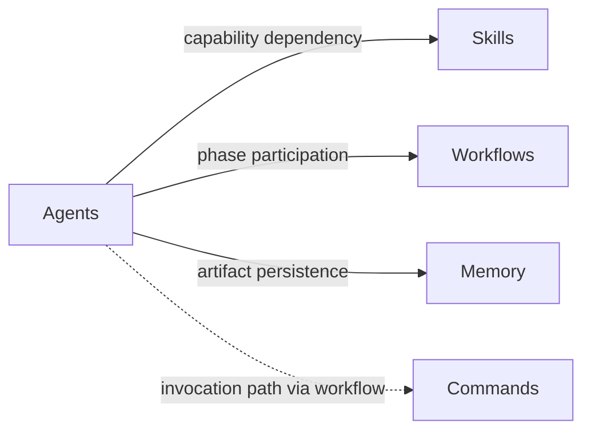
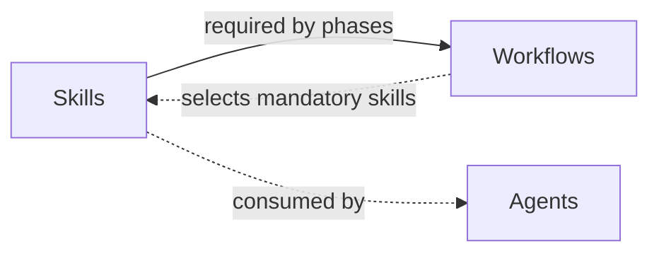
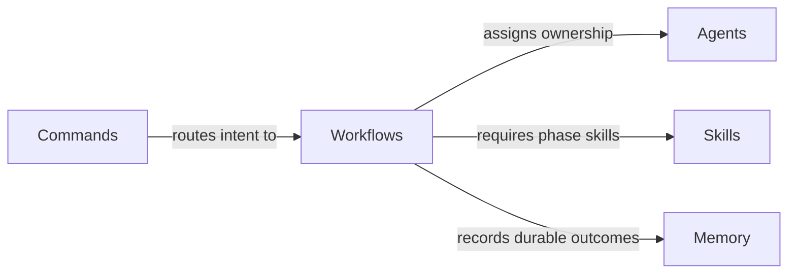
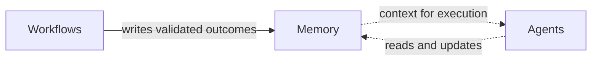
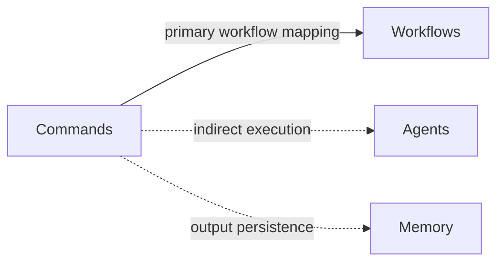
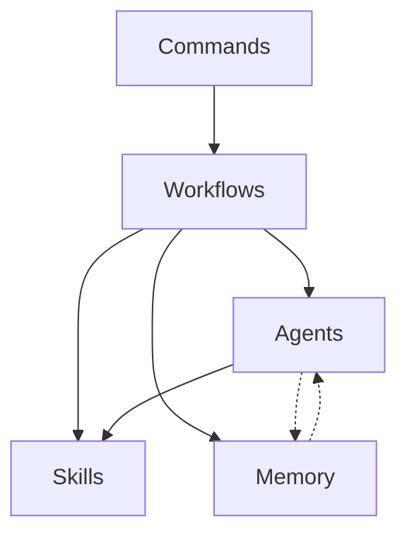

# Dependency Map

## Scope

This document defines dependency relationships for core framework components:
Agents, Skills, Workflows, Memory, and Commands.

Dependency notation:

- A -> B means A depends on B.
- Dashed links in diagrams represent read/reference dependencies.
- Solid links represent execution or control dependencies.

## 1) Agents Dependency Graph

## 2) Skills Dependency Graph

## 3) Workflows Dependency Graph

## 4) Memory Dependency Graph

## 5) Commands Dependency Graph

## 6) Combined Framework Graph

## Circular Dependency Detection

Detected cycles:

1. Workflows -> Agents -> Workflows
- Status: intentional governance loop.
- Risk: tight coupling between role definitions and workflow structure.

2. Workflows -> Memory -> Agents -> Workflows
- Status: intentional knowledge feedback loop.
- Risk: stale memory can propagate incorrect behavior into future workflow runs.

3. Skills -> Workflows -> Agents -> Skills
- Status: intentional capability loop.
- Risk: unresolved skill conflicts can affect workflow phase quality.

No direct Commands <-> Workflows cycle was detected in current contracts.

## Suggested Improvements

1. Introduce explicit dependency tiers.
- Tier 1: Commands -> Workflows.
- Tier 2: Workflows -> Agents and Skills.
- Tier 3: Agents/Workflows -> Memory.
- Benefit: clearer automation order and deterministic validation.

2. Add cycle policy classification in validation.
- Allowed cycles: governance and feedback loops.
- Prohibited cycles: command-level recursive routing.
- Benefit: prevents accidental circular execution paths.

3. Add dependency metadata constraints to registries.
- Require dependencyType values such as control, capability, data.
- Require maxDepth for transitive dependency traversal.
- Benefit: safer automation for graph traversal and impact analysis.

4. Add freshness constraints for memory dependencies.
- Enforce recency or validation timestamps before memory-backed execution.
- Benefit: reduces stale-knowledge propagation in cyclical loops.

5. Add graph validation checks in framework validation phase.
- Assert no prohibited cycles.
- Assert all dependencies resolve to active components.
- Benefit: early detection of structural regressions.
