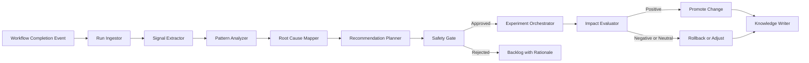

# Reflection Engine Specification

## Purpose

Define a continuous-improvement subsystem that evaluates each completed workflow run, identifies quality and efficiency gaps, and proposes controlled framework improvements.

## Scope

The Reflection Engine runs after every workflow execution and is responsible for:

- analyzing run outcomes, failures, retries, and gate decisions
- detecting recurring bottlenecks and policy mismatches
- generating prioritized improvement recommendations
- validating recommendation safety before adoption
- tracking realized impact after changes are applied

## Operating Model

The engine is event-driven and executes on run completion events.
Each reflection cycle produces one immutable reflection record linked to a run id.

## Architecture

### Core Components

- Run Ingestor
  - consumes final run package, logs, metrics, and audit records
- Signal Extractor
  - derives quality, reliability, and productivity signals from execution data
- Pattern Analyzer
  - identifies trends, recurring failures, and regression patterns
- Root Cause Mapper
  - maps observed issues to likely causes in workflows, agents, skills, context, or policies
- Recommendation Planner
  - generates concrete, testable improvement actions
- Safety Gate
  - validates risk, compliance, and rollback readiness for each action
- Experiment Orchestrator
  - applies approved changes in controlled rollout scopes
- Impact Evaluator
  - compares pre-change and post-change metrics to confirm benefit
- Knowledge Writer
  - records validated lessons into governed memory and decision artifacts

### High-Level Flow

## Reflection Lifecycle

### Phase 1: Ingest

- load completion package, state outcomes, gate decisions, and telemetry
- verify data completeness and schema integrity

### Phase 2: Diagnose

- compute reflection signals
- detect anomalies, regressions, and repeated failure motifs
- produce ranked probable causes with confidence scores

### Phase 3: Plan

- generate improvement proposals with expected impact and risk
- classify proposals by target area:
  - workflow design
  - routing policy
  - context resolver
  - skill resolver
  - memory resolver
  - output aggregation

### Phase 4: Govern

- apply approval and safety criteria
- assign ownership and execution window
- require rollback strategy for high-risk changes

### Phase 5: Experiment and Measure

- deploy approved changes to limited scope
- compare baseline vs trial metrics
- decide promote, revise, or rollback

### Phase 6: Learn and Persist

- publish reflection report entry
- update memory and decision logs with validated outcomes

## Inputs

- runtime completion package
- gate and validation records
- retry and failure ledgers
- task routing and resolver decisions
- output aggregator diagnostics
- historical reflection records and baseline metrics

## Outputs

- reflection record per run
- prioritized recommendation set
- approved change plan with owner and due date
- experiment outcome report
- memory and decision-log updates for validated learnings

## Reflection Signals

### Reliability Signals

- retry concentration by state and workflow
- rollback frequency and failure class distribution
- abort rate and unresolved blocker rate

### Quality Signals

- gate failure density
- output validation defect patterns
- post-release issue linkage to prior workflow decisions

### Efficiency Signals

- mean time to completion by workflow and phase
- high-latency state outliers
- context/skill/memory overloading indicators

### Consistency Signals

- divergence from template and schema expectations
- repeated conflict-resolution escalations
- policy override frequency

## Recommendation Model

Each recommendation must include:

- target component and scope
- observed problem statement
- evidence summary and confidence level
- proposed change
- expected measurable impact
- risk classification
- rollout strategy and rollback trigger
- validation metric and acceptance threshold

## Safety and Governance

- no automatic promotion for high-risk governance changes
- mandatory approval for policy-affecting recommendations
- enforce separation between analysis actor and approver for sensitive changes
- block changes without measurable acceptance criteria

## Experimentation Policy

- default rollout: canary by workflow or state subset
- trial period must cover statistically meaningful run count
- promotion requires improvement above configured threshold and no critical regressions
- rollback is automatic when breach conditions are met

## Impact Evaluation

### Baseline Comparison

Compare against trailing baseline window for:

- success rate
- gate failure rate
- MTTC
- retry and rollback rates
- output completeness failures

### Decision Rules

- Promote: significant positive delta with no critical side effects
- Revise: mixed results with identifiable remediation path
- Rollback: negative delta or policy/safety breach

## Data Model

### Reflection Record Fields

- reflection id
- run id and workflow version
- generated timestamp
- signal summary
- top causes with confidence scores
- recommendations and status
- experiment links
- final disposition

## Integration Points

- Runtime: receives completion events and run artifacts
- Resolvers: context, skill, and memory resolver diagnostics feed causality analysis
- Output Aggregator: provides merge/conflict telemetry for quality analysis
- Validation Module: consumes recommendation outcomes for governance reports
- Memory Module: persists validated lessons and supersession links

## Failure Handling

- if ingestion is incomplete, mark reflection as partial and requeue once
- if analysis confidence is low, emit advisory-only recommendations
- if experiment telemetry is insufficient, extend trial window before decision
- if evaluation pipeline fails, block promotion and retain current baseline

## Metrics

- reflection coverage rate (runs reflected / runs completed)
- recommendation acceptance rate
- recommendation effectiveness rate
- mean time to validated improvement
- rollback rate of promoted improvements
- repeated-issue recurrence rate after applied changes

## Non-Functional Requirements

- Deterministic analysis for identical input snapshots
- Full traceability from recommendation to source evidence
- Bounded runtime cost with configurable analysis depth
- Strong auditability for approvals and promotions
- Safe defaults that prioritize stability over aggressive optimization

## Future Extensions

- causal graph inference across workflows and shared dependencies
- adaptive recommendation ranking using historical impact
- cross-project benchmark baselines for anomaly detection
- human feedback weighting in recommendation scoring
- automated generation of draft policy updates with mandatory human approval
