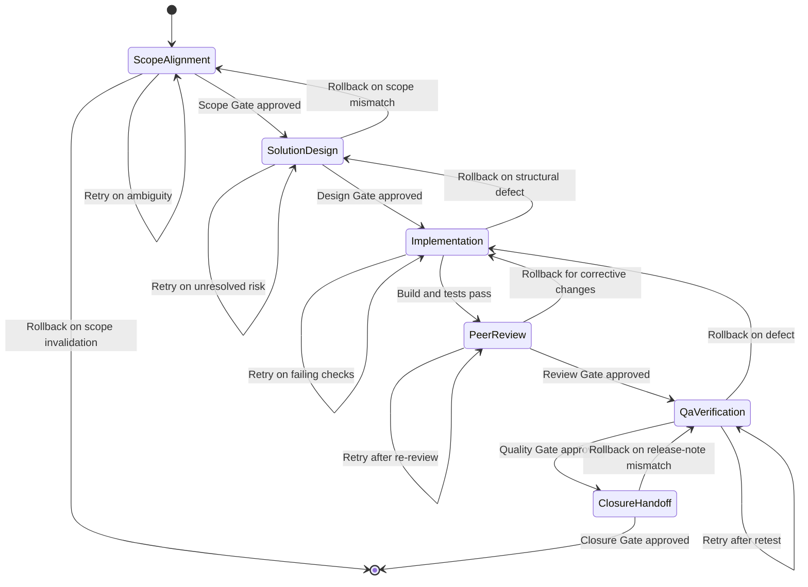
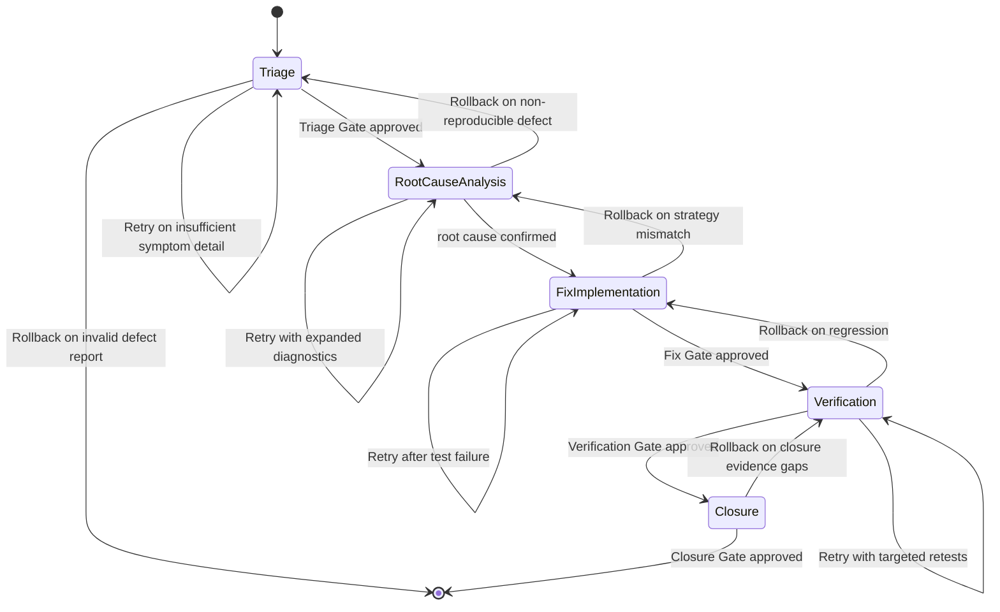
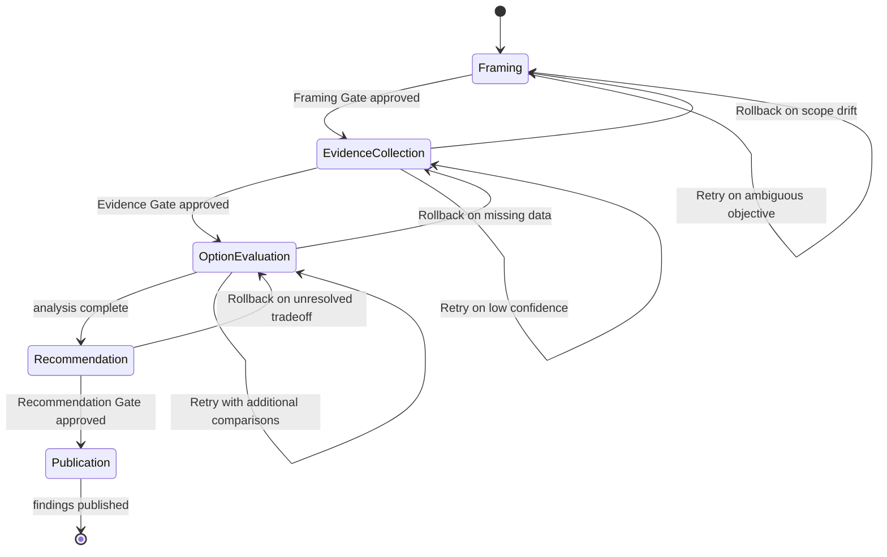
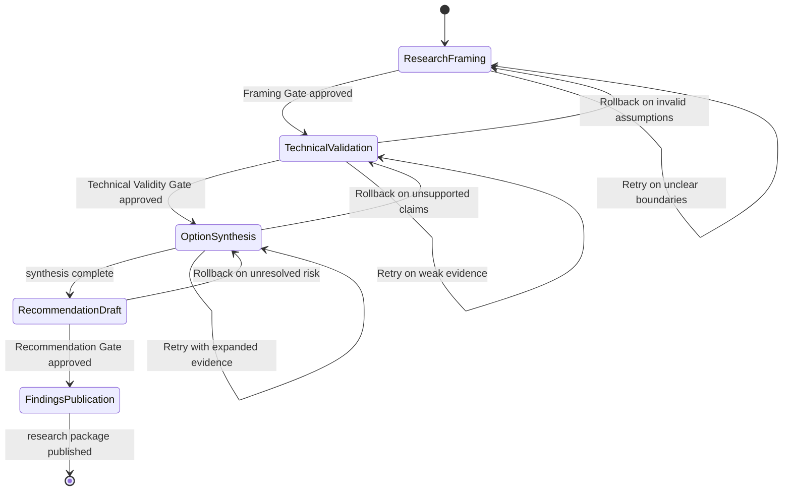
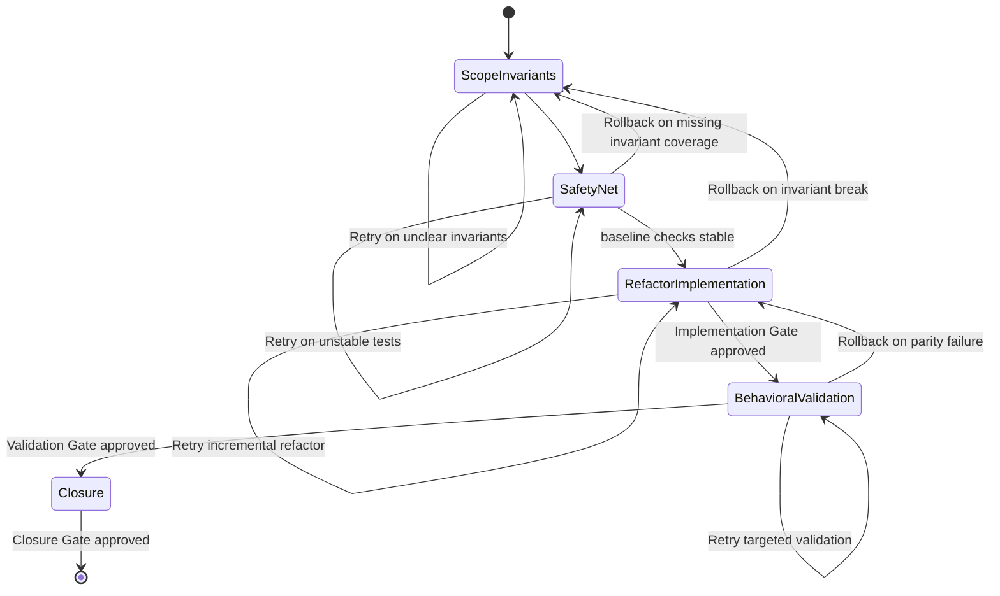
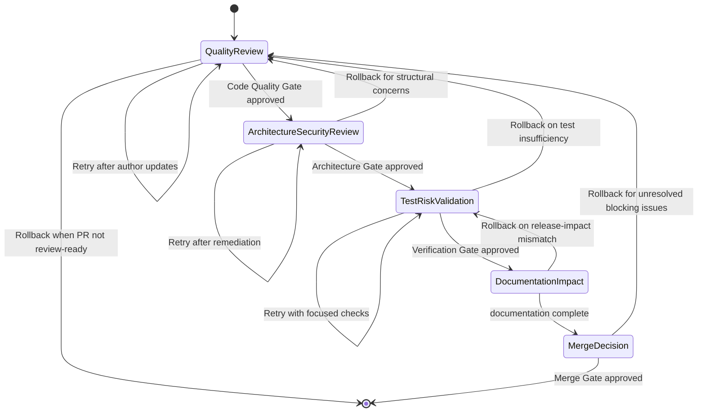
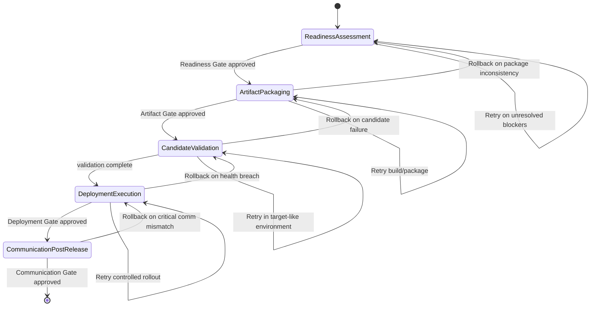

# Workflow Engine Specification

## Purpose

Define the execution engine for framework workflows as deterministic state machines.
Each workflow state explicitly defines ownership, data contract, transition criteria,
recovery behavior, and gate controls.

## State Contract

Every state in every workflow must define:

- Owner Agent
- Inputs
- Outputs
- Entry Conditions
- Exit Conditions
- Rollback Strategy
- Retry Strategy
- Approval Gates

---

## 1) Implement Feature State Machine

| State | Owner Agent | Inputs | Outputs | Entry Conditions | Exit Conditions | Rollback Strategy | Retry Strategy | Approval Gates |
|---|---|---|---|---|---|---|---|---|
| ScopeAlignment | omn-product-owner | feature request, acceptance intent, business constraints | scoped requirement summary, acceptance criteria | feature intent registered and context available | scope and acceptance are measurable | invalidate scope package and return to intake | clarify unresolved requirements with business analyst | Scope Gate (omn-product-owner, omn-business-analyst) |
| SolutionDesign | omn-architect | scoped requirements, technical constraints, risk targets | design record, architecture impact notes, risk plan | scope approved | design and risk strategy accepted | revert design package to previous approved baseline | iterate option analysis until risks are bounded | Design Gate (omn-architect, omn-tech-lead) |
| Implementation | omn-dev-1-implement | approved design, coding standards, test baseline | code changes, automated test evidence | design approved | implementation builds and tests pass | revert unsafe commits and restore last green baseline | rerun build/test and patch failing units | none |
| PeerReview | omn-dev-2-reviewer | code diff, test evidence, design references | findings log, correction directives, review verdict | implementation evidence available | critical findings resolved or accepted | return work to implementation state | re-review after corrections | Review Gate (omn-dev-2-reviewer) |
| QaVerification | omn-qa | reviewed changes, test plan, risk checklist | verification report, defect outcomes | review accepted | critical and major quality criteria satisfied | return to implementation for defect correction | execute focused retest cycles | Quality Gate (omn-dev-2-reviewer, omn-qa) |
| ClosureHandoff | omn-orchestrator | QA verdict, release notes draft, operational notes | closure package, release handoff record | quality gate approved | closure package complete and confirmed | return to QA verification on handoff inconsistency | retry documentation and closure checks | Closure Gate (omn-orchestrator, omn-documentation) |

---

## 2) Fix Bug State Machine

| State | Owner Agent | Inputs | Outputs | Entry Conditions | Exit Conditions | Rollback Strategy | Retry Strategy | Approval Gates |
|---|---|---|---|---|---|---|---|---|
| Triage | omn-dev-1-bug-analyst | defect report, symptom evidence, impact statement | severity classification, reproducibility decision | defect submitted with ownership | triage package confirms severity and reproducibility | reject invalid report and return to reporter | request missing evidence and re-triage | Triage Gate (omn-dev-1-bug-analyst, omn-tech-lead) |
| RootCauseAnalysis | omn-dev-1-bug-analyst | triage package, logs, traces, code context | root-cause statement, fix strategy | triage approved | root cause and correction strategy are evidence-backed | return to triage when reproduction fails | extend diagnostics and reevaluate hypothesis | none |
| FixImplementation | omn-dev-1-implement | approved fix strategy, affected modules, regression targets | corrective change set, regression tests | root cause accepted | fix implemented and reviewable | revert unsafe correction and return to analysis | iterate implementation until checks pass | Fix Gate (omn-dev-2-reviewer) |
| Verification | omn-qa | reviewed fix, test evidence, defect criteria | verification evidence, residual risk notes | fix gate approved | symptom removed and regressions covered | return to fix implementation for failures | rerun targeted and regression suites | Verification Gate (omn-qa) |
| Closure | omn-orchestrator | QA verdict, updated known issues, release notes impact | closure record, communication package | verification approved | closure artifacts complete and traceable | return to verification for missing evidence | retry closure checks and documentation sync | Closure Gate (omn-orchestrator, omn-documentation) |

---

## 3) Investigate State Machine

| State | Owner Agent | Inputs | Outputs | Entry Conditions | Exit Conditions | Rollback Strategy | Retry Strategy | Approval Gates |
|---|---|---|---|---|---|---|---|---|
| Framing | omn-business-analyst | investigation question, decision owner, constraints | framed objective, success criteria, scope bounds | investigation initiated | framing accepted by business and product owners | reset scope and restate objective | clarify assumptions and reframe | Framing Gate (omn-business-analyst, omn-product-owner) |
| EvidenceCollection | omn-context-agent | framing package, context sources, technical data access | evidence log, confidence ratings | framing approved | evidence set is sufficient for option analysis | return to framing when evidence violates scope | collect additional evidence and revalidate confidence | Evidence Gate (omn-context-agent, omn-architect) |
| OptionEvaluation | omn-architect | evidence log, constraints, evaluation criteria | tradeoff analysis, ranked options | evidence approved | option comparison is complete and coherent | return to evidence collection for data gaps | rerun evaluations with refined criteria | none |
| Recommendation | omn-tech-lead | option analysis, risk posture, effort estimates | recommended option, implementation implications | option evaluation complete | recommendation is decision-ready | return to option evaluation for unresolved impacts | revise recommendation with additional rationale | Recommendation Gate (omn-tech-lead, omn-orchestrator) |
| Publication | omn-documentation | approved recommendation, dependencies, next steps | published findings package, decision support summary | recommendation approved | findings distributed with traceable rationale | return to recommendation on inconsistency | retry publication packaging | none |

---

## 4) Research State Machine

| State | Owner Agent | Inputs | Outputs | Entry Conditions | Exit Conditions | Rollback Strategy | Retry Strategy | Approval Gates |
|---|---|---|---|---|---|---|---|---|
| ResearchFraming | omn-business-analyst | research question, decision scope, constraints | research brief, boundary definitions | research request accepted | objective and boundaries validated | rescope research and reset framing | clarify scope and stakeholder intent | Framing Gate (omn-business-analyst, omn-product-owner) |
| TechnicalValidation | omn-context-agent | research brief, technical sources, business evidence | validated evidence set, confidence levels | framing approved | evidence quality meets decision threshold | return to framing if assumptions collapse | collect additional evidence and revalidate | Technical Validity Gate (omn-context-agent, omn-architect) |
| OptionSynthesis | omn-architect | validated evidence, risk and effort criteria | option comparison, tradeoff summary | evidence validated | options cover feasible paths with tradeoffs | return to validation for unsupported options | rerun synthesis with refined criteria | none |
| RecommendationDraft | omn-tech-lead | option synthesis, risk posture, implementation impact | recommendation report, next-step implications | option synthesis complete | recommendation is approvable | return to option synthesis for unresolved concerns | revise recommendation and re-present | Recommendation Gate (omn-tech-lead, omn-orchestrator) |
| FindingsPublication | omn-documentation | approved recommendation, evidence references | final research package, decision communication | recommendation approved | findings published and traceable | return to draft on publication inconsistency | retry publication after artifact correction | none |

---

## 5) Refactor State Machine

| State | Owner Agent | Inputs | Outputs | Entry Conditions | Exit Conditions | Rollback Strategy | Retry Strategy | Approval Gates |
|---|---|---|---|---|---|---|---|---|
| ScopeInvariants | omn-tech-lead | refactor targets, baseline metrics, invariants proposal | refactor scope, invariants list, risk profile | refactor request accepted | invariants and risks explicitly defined | revert to previous scope definition | iterate scope and invariant definition | Scope Gate (omn-tech-lead, omn-architect) |
| SafetyNet | omn-qa | invariants list, existing tests, quality thresholds | strengthened test suite, baseline validation record | scope approved | safety net covers critical invariants | return to scope on missing coverage | add focused tests until stable | none |
| RefactorImplementation | omn-dev-1-implement | approved scope, safety net, coding standards | incremental refactor changes, updated tests | safety net established | code is reviewable and invariants preserved | revert offending changes to last safe commit | continue incremental refactor batches | Implementation Gate (omn-dev-2-reviewer) |
| BehavioralValidation | omn-qa | reviewed refactor, parity checklist, performance checks | parity validation report, regression status | implementation gate approved | no critical regressions and invariants preserved | return to implementation on parity failure | rerun targeted validations | Validation Gate (omn-qa) |
| Closure | omn-orchestrator | validation evidence, debt delta, documentation updates | closure summary, follow-up debt actions | validation approved | closure package accepted | return to validation for unresolved evidence | retry closure artifact completion | Closure Gate (omn-orchestrator) |

---

## 6) Review Pull Request State Machine

| State | Owner Agent | Inputs | Outputs | Entry Conditions | Exit Conditions | Rollback Strategy | Retry Strategy | Approval Gates |
|---|---|---|---|---|---|---|---|---|
| QualityReview | omn-dev-2-reviewer | stable PR diff, standards checklist, test evidence | quality findings, correction requests | PR declared review-ready | code quality risks are bounded | return PR to author for major issues | re-run quality review after updates | Code Quality Gate (omn-dev-2-reviewer) |
| ArchitectureSecurityReview | omn-architect | reviewed diff, architecture rules, security criteria | architecture/security findings, approval status | quality gate approved | architecture and security posture acceptable | return to quality review for structural corrections | re-evaluate after remediation | Architecture Gate (omn-architect) |
| TestRiskValidation | omn-qa | architecture-reviewed changes, test evidence, risk profile | test adequacy verdict, residual risk notes | architecture gate approved | verification evidence meets risk coverage | return to quality review if risk coverage is weak | perform additional focused validations | Verification Gate (omn-qa) |
| DocumentationImpact | omn-documentation | validated PR changes, release implications | documentation deltas, release impact notes | verification approved | documentation and release notes are coherent | return to test validation on inconsistencies | refine documentation package | none |
| MergeDecision | omn-tech-lead | full review package, unresolved findings list | merge recommendation, required actions | all prior review states completed | merge readiness approved or deferred with rationale | return to quality review on blocking issues | retry decision after required corrections | Merge Gate (omn-tech-lead, omn-orchestrator) |

---

## 7) Release State Machine

| State | Owner Agent | Inputs | Outputs | Entry Conditions | Exit Conditions | Rollback Strategy | Retry Strategy | Approval Gates |
|---|---|---|---|---|---|---|---|---|
| ReadinessAssessment | omn-tech-lead | release scope, prior gate evidence, risk posture | readiness report, blocker list, go/no-go recommendation | release scope frozen and prerequisites complete | critical blockers resolved and readiness confirmed | halt release and return to upstream workflows | re-evaluate after blocker remediation | Readiness Gate (omn-tech-lead, omn-qa) |
| ArtifactPackaging | omn-dev-2-reviewer | approved readiness report, build inputs, versioning rules | versioned artifacts, packaging evidence | readiness gate approved | artifacts are reproducible and auditable | return to readiness on artifact mismatch | rerun packaging pipeline with corrections | Artifact Gate (omn-dev-2-reviewer) |
| CandidateValidation | omn-qa | packaged artifacts, target-like environment, validation checklist | validation evidence, release candidate verdict | artifact gate approved | candidate satisfies operational and quality criteria | return to packaging for rebuild | rerun candidate tests and environment checks | none |
| DeploymentExecution | omn-orchestrator | candidate verdict, deployment plan, rollback plan | deployment status, monitoring health record | candidate validated | deployment is healthy and stable | trigger rollback and return to candidate validation | controlled redeploy within policy limits | Deployment Gate (omn-orchestrator) |
| CommunicationPostRelease | omn-documentation | deployment status, final change summary, stakeholder list | final release notes, post-release action plan | deployment gate approved | communication complete and acknowledged | return to deployment state on critical communication mismatch | republish corrected communication artifacts | Communication Gate (omn-documentation, omn-product-owner) |

---

## Engine Enforcement Rules

- State transitions are only valid when the current state's exit conditions are met.
- Rollback transitions must target a previously completed valid state.
- Retry transitions must remain within the same state and preserve audit history.
- Approval gate decisions are explicit transition events and must include owner sign-off.
- A workflow instance is complete only when terminal state is reached through approved transitions.
